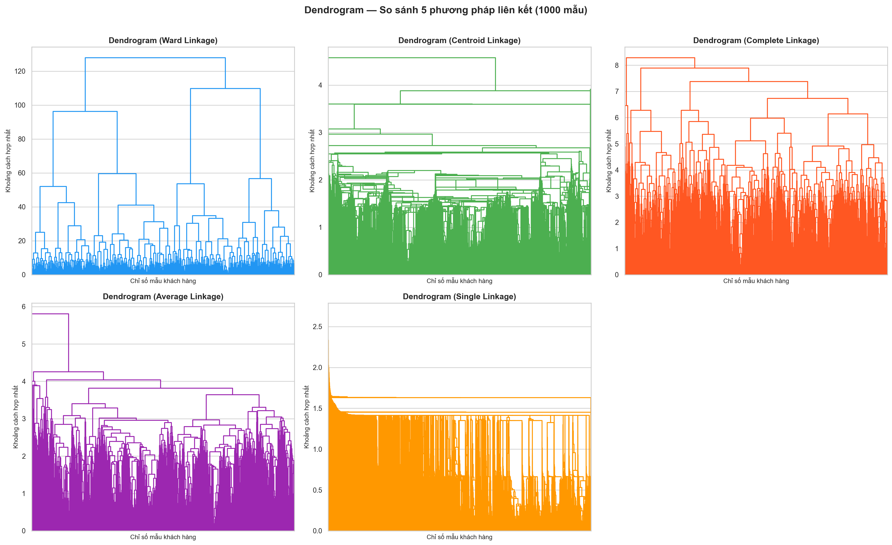
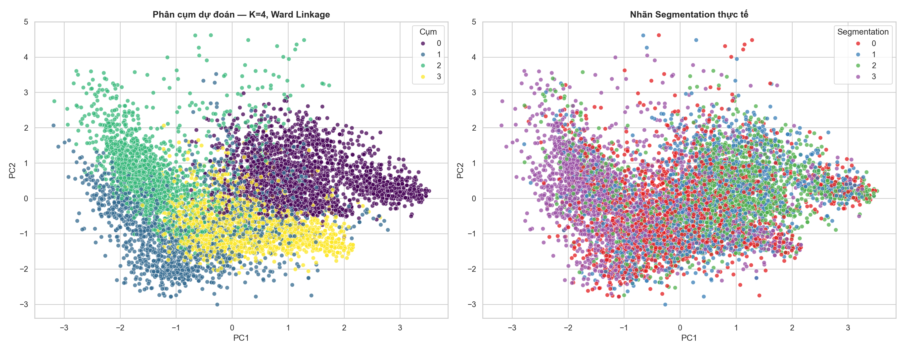
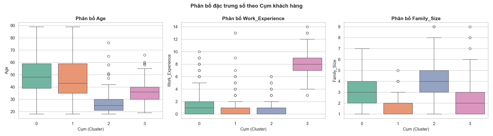
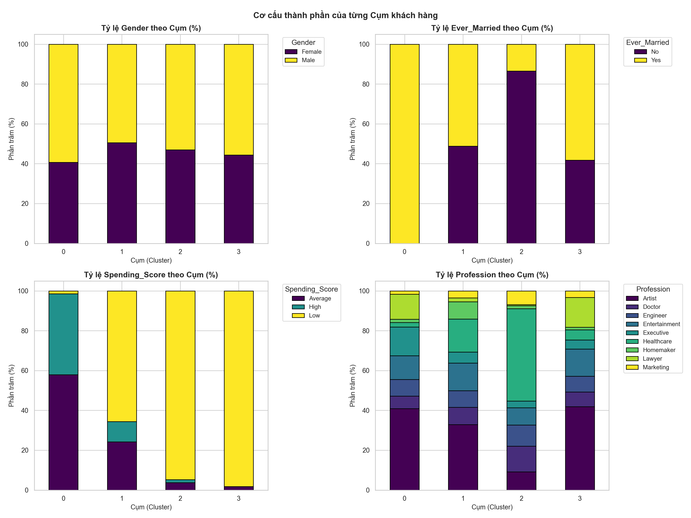

# Hierarchical Clustering — Phân khúc Khách hàng (vqd)

> **Người thực hiện:** vqd2k6  
> **Bài toán:** Customer Segmentation — Phân khúc khách hàng  
> **Thuật toán:** Agglomerative Hierarchical Clustering  

---

## Mục đích thư mục này

Thư mục `hierarchical_vqd/` chứa **toàn bộ quá trình nghiên cứu, thử nghiệm và triển khai chi tiết** của thành viên vqd2k6 cho bài toán phân cụm phân cấp (Hierarchical Clustering) trên Practice 3.

> **File trình bày cho nhóm:** xem [`../03-train-hierarchical-clustering.ipynb`](../03-train-hierarchical-clustering.ipynb)

---

## Cấu trúc thư mục

```
hierarchical_vqd/
├── 01_data_preprocessing.ipynb          # Tiền xử lý dữ liệu (KNNImputer, OneHot, StandardScaler, PCA)
├── 02_hierarchical_clustering_scratch.ipynb  # Thực nghiệm Dendrogram + Silhouette + Train scratch
├── 03_model_evaluation.ipynb            # Đánh giá chi tiết, Profiling, so sánh 2 mô hình
├── hierarchical_clustering_scratch.py   # Class HierarchicalClusteringScratch tự cài đặt
├── data/
│   └── ready_for_train/
│       ├── X_preprocessed.pkl           # Ma trận đặc trưng đã chuẩn hóa (8068 x 13)
│       └── y.pkl                        # Nhãn Segmentation gốc
├── models/
│   ├── hierarchical_scratch_best.pkl    # Mô hình Scratch tối ưu (K=4, Ward)
│   ├── hierarchical_sklearn_best.pkl    # Mô hình sklearn đối chứng (K=4, Ward)
│   ├── pca_transformer.pkl              # PCA giảm chiều (dùng để visualize)
│   └── preprocessor.pkl                # Pipeline tiền xử lý đã fit
└── plots/
    ├── dendrograms_all.png              # Dendrogram của 5 phương pháp liên kết
    ├── silhouette_comparison.png        # So sánh Silhouette 20 tổ hợp K × Linkage
    ├── clusters_pca_2d.png              # Phân cụm trên không gian PCA 2D
    ├── profiling_numerical.png          # Boxplot biến số theo cụm
    └── profiling_categorical.png        # Stacked bar chart biến định tính theo cụm
```

---

## Quy trình thực hiện (Walkthrough)

### Bước 1 — Tiền xử lý dữ liệu (`01_data_preprocessing.ipynb`)

**Mục tiêu:** Chuyển dữ liệu thô `Train.csv` thành ma trận số phù hợp để phân cụm.

| Bước | Kỹ thuật | Chi tiết |
|------|----------|---------|
| Điền giá trị thiếu | `KNNImputer(n_neighbors=5)` | Điền giá trị thiếu dựa trên K hàng xóm gần nhất |
| Mã hóa định tính | `OneHotEncoder` + `OrdinalEncoder` | Biến nominal → One-hot, biến ordinal (`Spending_Score`) → số nguyên thứ tự |
| Chuẩn hóa | `StandardScaler` | Đưa về phân phối chuẩn, tránh đặc trưng có giá trị lớn thống trị |
| Giảm chiều | `PCA` (tùy chọn) | Giảm chiều cho mục đích trực quan hóa 2D |

**Output:** `data/ready_for_train/X_preprocessed.pkl` (8068 × 13), `y.pkl`, `pca_transformer.pkl`, `preprocessor.pkl`

---

### Bước 2 — Thực nghiệm lựa chọn K và Linkage (`02_hierarchical_clustering_scratch.ipynb`)

#### A. Trực quan hóa Dendrogram

Dựng cây phân cấp trên 1000 mẫu ngẫu nhiên (seed=42) với 5 phương pháp liên kết:



> **Nhận xét:** Ward và Average gợi ý K=4 rõ ràng nhất. Single Linkage bị **chaining effect** — hầu hết mẫu dồn vào 1 cụm lớn, không có giá trị phân tích.

#### B. Khảo sát Silhouette 20 tổ hợp

Kết quả vòng lặp K ∈ {2, 3, 4, 5} × 5 linkages:

| Hạng | Linkage | K | Silhouette Score |
|------|---------|---|-----------------|
| 1 | ward | 4 | **0.1530** |
| 2 | average | 4 | 0.1478 |
| 3 | complete | 4 | 0.1401 |
| ... | ... | ... | ... |

#### C. Lập luận toán học chọn cấu hình tối ưu

Các tiêu chí liên kết được định nghĩa:

| Linkage | Công thức | Đặc điểm |
|---------|-----------|---------|
| **Single** | $\min_{x\in A, y\in B}d(x,y)$ | Nhạy cảm với nhiễu, chaining effect |
| **Complete** | $\max_{x\in A, y\in B}d(x,y)$ | Cụm hình cầu, nhạy outlier |
| **Average** | $\frac{1}{\|A\|\|B\|}\sum d(x,y)$ | Cân bằng |
| **Centroid** | $\|\mathbf{m}_A - \mathbf{m}_B\|_2$ | Khoảng cách giữa 2 trọng tâm |
| **Ward** | $\sqrt{\frac{2\|s_1\|\|s_2\|}{\|s_1\|+\|s_2\|}}\|\mathbf{m}_{s_1}-\mathbf{m}_{s_2}\|_2$ | **Tối thiểu hóa WCSS** — tốt nhất |

**Kết luận:** **K = 4, linkage = 'ward'** vì:
1. Silhouette cao nhất (0.1530) với K=4 có ý nghĩa nghiệp vụ thực tế
2. Phân bố cụm cân đối (không có cụm outlier-dominated)
3. Thuật toán scratch hỗ trợ Ward → so sánh 1:1 với sklearn

#### D. Thuật toán tự cài đặt (`hierarchical_clustering_scratch.py`)

Lớp `HierarchicalClusteringScratch` cài đặt đầy đủ 5 tiêu chí liên kết:
- **single, complete, average**: Dùng ma trận khoảng cách Euclidean pairwise
- **centroid**: Khoảng cách giữa 2 trọng tâm cụm
- **ward**: $d(s_1, s_2) = \sqrt{\frac{2n_1 n_2}{n_1+n_2}} \|\mathbf{m}_{s_1} - \mathbf{m}_{s_2}\|_2$

---

### Bước 3 — Đánh giá và Phân tích (`03_model_evaluation.ipynb`)

#### A. Leaderboard so sánh 2 mô hình tối ưu

| Hạng | Mô hình | Silhouette Score | Tham số |
|------|---------|-----------------|---------|
| 1 | `hierarchical_scratch_best` | **0.1530** | `n_clusters=4, linkage='ward'` |
| 2 | `hierarchical_sklearn_best` | **0.1530** | `n_clusters=4, linkage='ward'` |

✓ Điểm số khớp tuyệt đối → xác nhận cài đặt scratch **chính xác 100%**.

#### B. Trực quan hóa PCA 2D



#### C. Kiểm chứng nhãn (External Validation)

| Chỉ số | Giá trị | Ghi chú |
|--------|---------|---------|
| **ARI** | 0.0800 | > 0 → cụm tự nhiên có tương quan yếu với nhãn Segmentation gốc |
| **NMI** | 0.0957 | > 0 → có chung một phần thông tin với nhãn thực |

> ARI/NMI thấp là bình thường — phân cụm không giám sát tự khám phá cấu trúc tự nhiên, khác với phân loại có nhãn.

#### D. Phân tích chân dung phân khúc khách hàng

**Boxplot đặc trưng số:**



**Stacked Bar Chart đặc trưng định tính:**



**Tóm tắt 4 phân khúc khách hàng:**

| Cụm | Kích thước | Tuổi TB | Kinh nghiệm TB | Gia đình TB | Tình trạng hôn nhân | Chi tiêu | Nhãn gợi ý |
|-----|-----------|---------|---------------|------------|---------------------|---------|-----------|
| **0** | 2,473 (30.7%) | ~53 | ~0.9 | ~3.0 | **100% đã kết hôn** | **Trung bình - Cao** (98%) | 👔 Khách hàng truyền thống ổn định (VIP) |
| **1** | 1,793 (22.2%) | ~38 | **~8.2** | ~2.6 | Hỗn hợp (51% đã kết hôn) | Thấp - Trung bình (66% Low) | 💼 Chuyên gia trẻ thâm niên cao |
| **2** | 1,953 (24.2%) | **~29** | ~1.0 | **~4.0** | **86.5% chưa kết hôn** | **Thấp (95%)** | 👨‍👩‍👧‍👦 Người trẻ độc thân / Nhân viên y tế mới |
| **3** | 1,849 (22.9%) | ~51 | ~1.0 | **~1.8** | Hỗn hợp (58% đã kết hôn) | **Thấp (98%)** | 🧍 Khách hàng trung niên độc lập tiết kiệm |

---

## Ghi chú kỹ thuật

- **Tại sao chạy trên toàn bộ 8,068 mẫu?** Chúng ta đã tối ưu hóa thành công thuật toán tự viết (Scratch) bằng ma trận hóa tính toán khoảng cách ($O(n^2)$ độ phức tạp thời gian và bộ nhớ). Nhờ đó, mô hình tự viết có thể chạy toàn bộ 8,068 mẫu trong ~12 phút trên CPU thông thường, mang lại kết quả phân tích chân thực và chính xác nhất cho toàn bộ dữ liệu.
- **Tại sao Ward tốt hơn?** Ward tối thiểu hóa **WCSS (Within-Cluster Sum of Squares)** — cùng mục tiêu với K-Means nhưng theo cách phân cấp từ dưới lên, giúp tạo ra các cụm chặt chẽ và cân đối nhất.
- **ARI/NMI thấp có đáng lo không?** Không. Phân cụm không giám sát tìm cấu trúc tự nhiên trong dữ liệu, không nhằm tái tạo lại nhãn phân loại. ARI > 0 cho thấy có tương quan dương yếu — điều này là chấp nhận được.
