# Problem Definition (Define Problem)

---

## Business Context and Problem Statement

The customer segmentation problem aims to assist the business in understanding key potential customer groups in a new market. This facilitates consumer behavior analysis, optimizes marketing campaigns, and enables product/service personalization (e.g., selling automobiles).

---

## Mathematical Problem Formulation

### Input Data ($X$)
Let the input customer dataset be defined as $X = \{x_1, x_2, \dots, x_N\}$, where:
- $N$ is the total number of customer records ($N = 8068$ samples in `Train.csv`).
- Each customer $x_i$ is represented by a $D$-dimensional feature vector: $x_i = [x_{i1}, x_{i2}, \dots, x_{iD}]^T \in \mathbb{R}^D$, representing attributes such as `Age`, `Work_Experience`, `Family_Size`, and encoded categorical attributes (`Gender`, `Ever_Married`, `Graduated`, `Profession`, `Spending_Score`, `Var_1`).

### Output Labels ($C$)
The objective is to find a cluster assignment partition $C = \{c_1, c_2, \dots, c_N\}$, where:
- $c_i \in \{1, 2, \dots, K\}$ denotes the Cluster ID assigned to customer $x_i$.
- $K$ is the number of target clusters (customer segments) to be determined through optimization metrics.
- For noise-detecting algorithms like DBSCAN, some points may be assigned a label of $-1$ (Noise), indicating they do not belong to any formal cluster.

---

## Mathematical Foundations of the 4 Clustering Algorithms

We will implement the following four classic clustering algorithms from scratch:

### K-Means Clustering
- **Core Concept**: Partitions data into $K$ clusters such that the distance between points in the same cluster and their cluster centroid is minimized.
- **Centroid**: 
  $$\mu_k = \frac{1}{|S_k|} \sum_{x_i \in S_k} x_i$$ 
  *(Not necessarily an actual data point in the dataset)*.
- **Objective Function to Minimize** (Within-Cluster Sum of Squares - WCSS / Inertia):
  $$J_{\text{K-Means}} = \sum_{k=1}^K \sum_{x_i \in S_k} \|x_i - \mu_k\|^2$$
- **Characteristics**: Sensitive to outliers due to the squared Euclidean distance (L2 norm) and tends to form spherical clusters of similar sizes.

### K-Medoids Clustering
- **Core Concept**: Similar to K-Means, but instead of using the mathematical mean as the cluster representative, K-Medoids selects an actual data point from the cluster (**Medoid**).
- **Medoid**: A point $m_k \in S_k$ satisfying:
  $$m_k = \arg\min_{y \in S_k} \sum_{x_i \in S_k} d(x_i, y)$$
- **Objective Function to Minimize**:
  $$J_{\text{K-Medoids}} = \sum_{k=1}^K \sum_{x_i \in S_k} d(x_i, m_k)$$
- **Characteristics**: Highly robust to outliers and noise by utilizing absolute distances or custom distance matrices (e.g., Manhattan distance).

### DBSCAN (Density-Based Spatial Clustering of Applications with Noise)
- **Core Concept**: Clusters data based on point density. High-density regions form clusters, while sparse regions are classified as noise.
- **Core Parameters**:
  - $\epsilon$ (Epsilon): The neighborhood radius of a point.
  - $MinPts$ (Minimum Points): The minimum number of points within the $\epsilon$-neighborhood (including the point itself).
- **Point Classification**:
  - **Core Point**: Has at least $MinPts$ points within its $\epsilon$-neighborhood.
  - **Border Point**: Has fewer than $MinPts$ points in its $\epsilon$-neighborhood but lies within the $\epsilon$-neighborhood of a Core Point.
  - **Noise Point**: Neither a Core Point nor a Border Point.
- **Characteristics**: Capable of discovering clusters of arbitrary shapes, automatically detects noise, and does not require pre-specifying the number of clusters $K$.

### Hierarchical Clustering (Agglomerative)
- **Core Concept**: A bottom-up approach where each data point starts as its own cluster, and the closest pairs of clusters are successively merged until only a single cluster remains (forming a Dendrogram tree).
- **Linkage Distance Metrics**:
  - **Single Linkage**:
    $$d(A, B) = \min \{ d(x, y) : x \in A, y \in B \}$$
  - **Complete Linkage**:
    $$d(A, B) = \max \{ d(x, y) : x \in A, y \in B \}$$
  - **Average Linkage**:
    $$d(A, B) = \frac{1}{|A||B|} \sum_{x \in A} \sum_{y \in B} d(x, y)$$
  - **Centroid Linkage**:
    $$d(A, B) = d(\mu_A, \mu_B)$$
  - **Ward Linkage** (minimizes the increase in total within-cluster variance):
    $$\Delta(A, B) = \frac{|A||B|}{|A|+|B|} \| \mu_A - \mu_B \|^2$$
- **Characteristics**: Produces an intuitive Dendrogram visualization, making it easy to analyze hierarchical relationships among customer segments.

---

# Data Validation (Data Collection & Validation)

---

## Loading Raw Dataset

The raw dataset is stored in `../data/raw/`.

```python
train_path = "../data/raw/Train.csv"
train_df = pd.read_csv(train_path)

print(f"Kích thước tập Train: {train_df.shape}")
```

#### Output:
```text
Kích thước tập Train: (8068, 11)
```

#### Remarks:
- The raw training dataset (`Train.csv`) contains 8,068 customer records and 11 features. This sample size is sufficiently large to train unsupervised clustering algorithms and model customer behavior stably.

---

## Previewing Initial Data Records

To check the actual structure of the dataset, we print the first 20 records.

```python
train_df.head(20)
```

#### Output:
```text
        ID  Gender Ever_Married  Age Graduated     Profession  Work_Experience Spending_Score  Family_Size  Var_1 Segmentation
0   462809    Male           No   22        No     Healthcare              1.0            Low          4.0  Cat_4            D
1   462643  Female          Yes   38       Yes       Engineer              NaN        Average          3.0  Cat_4            A
2   466315  Female          Yes   67       Yes       Engineer              1.0            Low          1.0  Cat_6            B
3   461735    Male          Yes   67       Yes         Lawyer              0.0           High          2.0  Cat_6            B
4   462669  Female          Yes   40       Yes  Entertainment              NaN           High          6.0  Cat_6            A
5   461319    Male          Yes   56        No         Artist              0.0        Average          2.0  Cat_6            C
6   460156    Male           No   32       Yes     Healthcare              1.0            Low          3.0  Cat_6            C
7   464347  Female           No   33       Yes     Healthcare              1.0            Low          3.0  Cat_6            D
8   465015  Female          Yes   61       Yes       Engineer              0.0            Low          3.0  Cat_7            D
9   465176  Female          Yes   55       Yes         Artist              1.0        Average          4.0  Cat_6            C
10  464041  Female           No   26       Yes       Engineer              1.0            Low          3.0  Cat_6            A
11  464942    Male           No   19        No     Healthcare              4.0            Low          4.0  Cat_4            D
12  461230  Female           No   19        No      Executive              0.0            Low          NaN  Cat_3            D
13  459573    Male          Yes   70        No         Lawyer              NaN            Low          1.0  Cat_6            A
14  460849  Female          Yes   58        No         Doctor              0.0            Low          1.0  Cat_3            B
15  460563  Female           No   41        No     Healthcare              1.0            Low          2.0  Cat_1            C
16  466865  Female           No   32        No      Homemaker              9.0            Low          5.0  Cat_3            D
17  461644    Male           No   31        No     Healthcare              1.0            Low          6.0  Cat_6            B
18  466772    Male          Yes   58       Yes  Entertainment              1.0        Average          4.0  Cat_6            B
19  464291  Female          Yes   79       Yes         Artist              0.0           High          1.0  Cat_6            C
```

#### Remarks:
- The dataset consists of both quantitative numerical features (`Age`, `Work_Experience`, `Family_Size`) and qualitative categorical features (`Gender`, `Ever_Married`, `Graduated`, `Profession`, `Spending_Score`, `Var_1`).
- Missing values are present and represented as `NaN` (e.g., in index 1: `Work_Experience` is missing; index 12: `Family_Size` is missing). The `Segmentation` label serves as reference data to validate clustering accuracy.

---

## Data Type Inspections (Data Types)

We check the data types of each feature to formulate an appropriate encoding and preprocessing strategy.

```python
train_df.info()
```

#### Output:
```text
<class 'pandas.core.frame.DataFrame'>
RangeIndex: 8068 entries, 0 to 8067
Data columns (total 11 columns):
 #   Column           Non-Null Count  Dtype  
---  ------           --------------  -----  
 0   ID               8068 non-null   int64  
 1   Gender           8068 non-null   object 
 2   Ever_Married     7928 non-null   object 
 3   Age              8068 non-null   int64  
 4   Graduated        7990 non-null   object 
 5   Profession       7944 non-null   object 
 6   Work_Experience  7239 non-null   float64
 7   Spending_Score   8068 non-null   object 
 8   Family_Size      7733 non-null   float64
 9   Var_1            7992 non-null   object 
 10  Segmentation     8068 non-null   object 
dtypes: float64(2), int64(2), object(7)
memory usage: 693.5+ KB
```

#### Remarks:
- The raw dataset contains 11 columns, including 4 numerical columns (`ID` as `int64`, `Age` as `int64`, `Work_Experience` as `float64`, `Family_Size` as `float64`) and 7 categorical columns (`object`).
- Variations in the non-null count across columns (e.g., `Work_Experience` has 7,239 non-null records compared to the total of 8,068 rows) indicate the presence of missing values.

---

## Checking Missing Values (Missing Values)

We summarize the missing count and percentage for each feature.

```python
def check_missing_values(df):
    missing_count = df.isnull().sum()
    missing_percent = (df.isnull().sum() / len(df)) * 100
    missing_table = pd.concat([missing_count, missing_percent], axis=1, keys=['Missing Count', 'Percentage (%)'])
    return missing_table[missing_table['Missing Count'] > 0].sort_values(by='Missing Count', ascending=False)

print("--- Các cột bị khuyết thiếu ở tập Train ---")
print(check_missing_values(train_df))
```

#### Output:
```text
--- Các cột bị khuyết thiếu ở tập Train ---
                 Missing Count  Percentage (%)
Work_Experience            829       10.275161
Family_Size                335        4.152206
Ever_Married               140        1.735250
Profession                 124        1.536936
Graduated                   78        0.966782
Var_1                       76        0.941993
```

#### Remarks:
- The `Work_Experience` feature has the highest missing rate (829 rows - 10.28%), followed by `Family_Size` (335 rows - 4.15%).
- Other columns exhibit relatively minor missing rates (< 2%). Suitable cleaning strategies (such as Mode imputation or row removal) will be executed in the data cleaning phase.

---

## Checking Duplicate Records (Duplicate Rows)

We verify if there are duplicate rows in the dataset.

```python
duplicates_total = train_df.duplicated().sum()
duplicates_id = train_df.duplicated(subset=['ID']).sum()
print(f"Số dòng trùng lặp hoàn toàn: {duplicates_total}")
print(f"Số dòng bị trùng lặp ID: {duplicates_id}")
```

#### Output:
```text
Số dòng trùng lặp hoàn toàn: 0
Số dòng bị trùng lặp ID: 0
```

#### Remarks:
- No completely identical duplicate rows or duplicate `ID` values were detected. Each row represents a unique customer, ensuring the uniqueness of the inputs.

---

## Preliminary Exploration of Categorical Variables

To ensure the quality of categorical attributes, we check the unique labels of each categorical feature.

```python
categorical_cols = train_df.select_dtypes(include=['object']).columns
for col in categorical_cols:
    print(f"Cột {col}: {train_df[col].dropna().unique()}")
```

#### Output:
```text
Cột Gender: ['Male' 'Female']
Cột Ever_Married: ['No' 'Yes']
Cột Graduated: ['No' 'Yes']
Cột Profession: ['Healthcare' 'Engineer' 'Lawyer' 'Entertainment' 'Artist' 'Executive'
 'Doctor' 'Homemaker' 'Marketing']
Cột Spending_Score: ['Low' 'Average' 'High']
Cột Var_1: ['Cat_4' 'Cat_6' 'Cat_7' 'Cat_3' 'Cat_1' 'Cat_2' 'Cat_5']
Cột Segmentation: ['D' 'A' 'B' 'C']
```

#### Remarks:
- All categorical fields are well-formatted, with no spelling anomalies or duplicate labels (such as lowercase/uppercase mix-ups).
- `Spending_Score` contains 3 ordered values (`Low`, `Average`, `High`). The target reference `Segmentation` has four unique categories (`A`, `B`, `C`, `D`).

---

## Descriptive Statistics

We examine the statistics of the numerical attributes.

```python
train_df.describe().T
```

#### Output:
```text
                  count           mean          std       min        25%       50%        75%       max
ID              8068.0  463479.214551  2595.381232  458982.0  461240.75  463472.5  465744.25  467974.0
Age             8068.0      43.466906    16.711696      18.0      30.00      40.0      53.00      89.0
Work_Experience 7239.0       2.641663     3.406763       0.0       0.00       1.0       4.00      14.0
Family_Size     7733.0       2.850123     1.531413       1.0       2.00       3.0       4.00       9.0
```

#### Remarks:
- **Age**: The average customer age is 43.47 years, ranging from 18 to 89. The median age is 40, showing that the customer base is centered around middle-aged demographics.
- **Work_Experience**: The average work experience is relatively low (~2.64 years), and 50% of the customers have 1 year of experience or less. This represents a strongly right-skewed distribution.
- **Family_Size**: The average family size is 2.85 members, ranging from 1 to 9.

---

## Logical Consistency Checks (Consistency Checks)

To guarantee the reliability of the customer self-reported attributes, we inspect logic inconsistencies between features.

### Contradiction between Age and Work Experience (Age vs. Work Experience)
Usually, a professional career begins around age 15 or later. If the difference `Age - Work_Experience` is less than 15, it represents a logical contradiction.

```python
work_age_anomaly = train_df[train_df['Age'] - train_df['Work_Experience'] < 15]
print(f"Số lượng bản ghi bất thường (Age - Work_Exp < 15): {len(work_age_anomaly)}")
if len(work_age_anomaly) > 0:
    print("
Ví dụ 5 bản ghi bất thường đầu tiên:")
    print(work_age_anomaly[['ID', 'Age', 'Work_Experience', 'Profession']].head(5))
```

#### Output:
```text
Số lượng bản ghi bất thường (Age - Work_Exp < 15): 137

Ví dụ 5 bản ghi bất thường đầu tiên:
          ID  Age  Work_Experience  Profession
42    464590   27             14.0      Artist
108   466466   19              6.0  Healthcare
132   464857   18              6.0  Healthcare
176   464866   23             11.0    Engineer
201   466065   19              9.0  Healthcare
```

#### Remarks:
- We found 137 cases where the age and years of experience are logically inconsistent (e.g., ID 108 is 19 years old but has 6 years of experience, implying they started professional employment at 13; ID 201 is 19 years old with 9 years of experience). These records represent noise and will be removed during cleaning.

### Contradiction between Profession and Education (Profession vs. Graduation)
In practice, specialized professions such as Doctor or Lawyer require a university degree (`Graduated == 'Yes'`). We check if there are individuals declaring these occupations without a degree.

```python
profession_anomaly = train_df[(train_df['Profession'].isin(['Doctor', 'Lawyer'])) & (train_df['Graduated'] == 'No')]
print(f"Số lượng bác sĩ/luật sư chưa tốt nghiệp: {len(profession_anomaly)}")
if len(profession_anomaly) > 0:
    print("
Ví dụ 5 bản ghi đầu tiên:")
    print(profession_anomaly[['ID', 'Profession', 'Graduated']].head(5))
```

#### Output:
```text
Số lượng bác sĩ/luật sư chưa tốt nghiệp: 518

Ví dụ 5 bản ghi đầu tiên:
        ID Profession Graduated
13  459573     Lawyer        No
14  460849     Doctor        No
31  462216     Doctor        No
34  459861     Lawyer        No
36  465572     Doctor        No
```

#### Remarks:
- We found 518 contradictory records where customers declared their profession as Lawyer or Doctor but their graduation status was registered as 'No'. This contradiction accounts for a significant portion (~6.42% of the raw data) and represents self-reporting inaccuracies.

# Data Cleaning

---

## Removing Duplicate Records (Duplicates)

Before analysis and modeling, completely identical duplicate records and duplicate customer IDs must be removed to avoid biases in clustering density.

```python
# Remove completely identical duplicates
train_df = train_df.drop_duplicates()

# Remove duplicate IDs (keep first occurrence)
train_df = train_df.drop_duplicates(subset=['ID'], keep='first')
```

#### Remarks:
- Cleaning duplicate records was executed successfully. Since the validation step confirmed the absence of completely identical records or duplicate IDs, the dataset size remained unchanged.

---

## Removing Logically Inconsistent Values (Sanity Outliers Cleaning)

To preserve the realism and integrity of the training data, we remove the logically inconsistent records discovered during the validation phase:
1. Customers reporting employment before the age of 15 (`Age - Work_Experience < 15`).
2. Customers reporting their profession as Doctor or Lawyer who have not graduated from university (`Graduated == 'No'`).

```python
# Size before cleaning
size_before = train_df.shape[0]

# 1. Identify records violating logic (ignore NaNs for now to handle in the missing values step)
mask_anomaly_age = (train_df['Age'] - train_df['Work_Experience'] < 15)
mask_anomaly_prof = (train_df['Profession'].isin(['Doctor', 'Lawyer'])) & (train_df['Graduated'] == 'No')

# 2. Drop inconsistent records
train_df = train_df[~(mask_anomaly_age | mask_anomaly_prof)]

size_after = train_df.shape[0]
print(f"Kích thước trước khi lọc logic: {size_before}")
print(f"Kích thước sau khi lọc logic:  {size_after}")
```

#### Output:
```text
Kích thước trước khi lọc logic: 8068
Kích thước sau khi lọc logic:  7422
```

#### Remarks:
- The logical filtering successfully removed 646 records (representing ~8.01% of the raw dataset). Dropping these records is necessary because inconsistent data points introduce noise and distort the density boundaries of density-sensitive models like DBSCAN and K-Means.

---

## Pre-treatment Missing Values Analysis

To select a mathematically sound strategy for handling missing data, we analyze the distribution of the missing numerical and categorical variables.

### Visualizing Distributions of Missing Numerical Variables (`Work_Experience` and `Family_Size`)

```python
fig, axes = plt.subplots(1, 2, figsize=(14, 5))

# Distribution of Work_Experience
sns.histplot(data=train_df, x='Work_Experience', kde=True, ax=axes[0], color='skyblue', binwidth=1)
mean_work = train_df['Work_Experience'].mean()
median_work = train_df['Work_Experience'].median()
axes[0].axvline(mean_work, color='red', linestyle='--', linewidth=2, label=f"Mean: {mean_work:.2f}")
axes[0].axvline(median_work, color='green', linestyle='-', linewidth=2, label=f"Median: {median_work:.2f}")
axes[0].set_title(f"Phân phối Work_Experience (Skewness: {train_df['Work_Experience'].skew():.2f})")
axes[0].set_xlabel("Số năm kinh nghiệm")
axes[0].legend()

# Distribution of Family_Size
sns.histplot(data=train_df, x='Family_Size', kde=False, discrete=True, ax=axes[1], color='salmon')
mean_fam = train_df['Family_Size'].mean()
median_fam = train_df['Family_Size'].median()
axes[1].axvline(mean_fam, color='red', linestyle='--', linewidth=2, label=f"Mean: {mean_fam:.2f}")
axes[1].axvline(median_fam, color='green', linestyle='-', linewidth=2, label=f"Median: {median_fam:.2f}")
axes[1].set_title(f"Phân phối Family_Size (Skewness: {train_df['Family_Size'].skew():.2f})")
axes[1].set_xlabel("Số thành viên gia đình")
axes[1].legend()

plt.tight_layout()
```

#### Output:
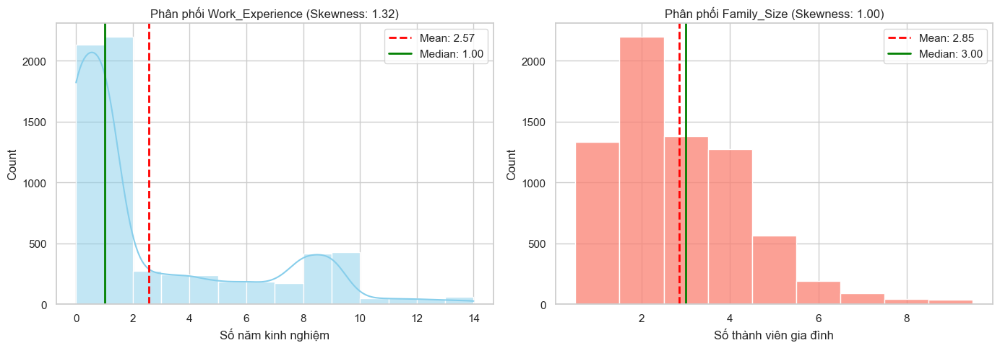

#### Mathematical Evaluation from Chart:
1. **Work_Experience**: The distribution is highly right-skewed (Skewness ~1.32). The majority of customers cluster around 0-1 year of experience. Imputing with the **Median (1.0)** is better than the Mean (2.57) because it accurately reflects the center of the distribution and prevents skewing.
2. **Family_Size**: This is a discrete variable. Imputing with the Mean (2.85) would create decimal values, which are physically meaningless. Thus, the **Median (3.0)** is the optimal choice to maintain the integer nature of this feature.

### Visualizing Distributions of Missing Categorical Variables (`Ever_Married`, `Graduated`, `Profession`, `Var_1`)

```python
cat_cols_nan = ['Ever_Married', 'Graduated', 'Profession', 'Var_1']
fig, axes = plt.subplots(2, 2, figsize=(15, 10))
axes = axes.flatten()

for i, col in enumerate(cat_cols_nan):
    sns.countplot(data=train_df, x=col, ax=axes[i], order=train_df[col].value_counts().index, palette='viridis')
    axes[i].set_title(f"Phân bổ tần suất cột: {col}")
    axes[i].tick_params(axis='x', rotation=45)

plt.tight_layout()
```

#### Output:
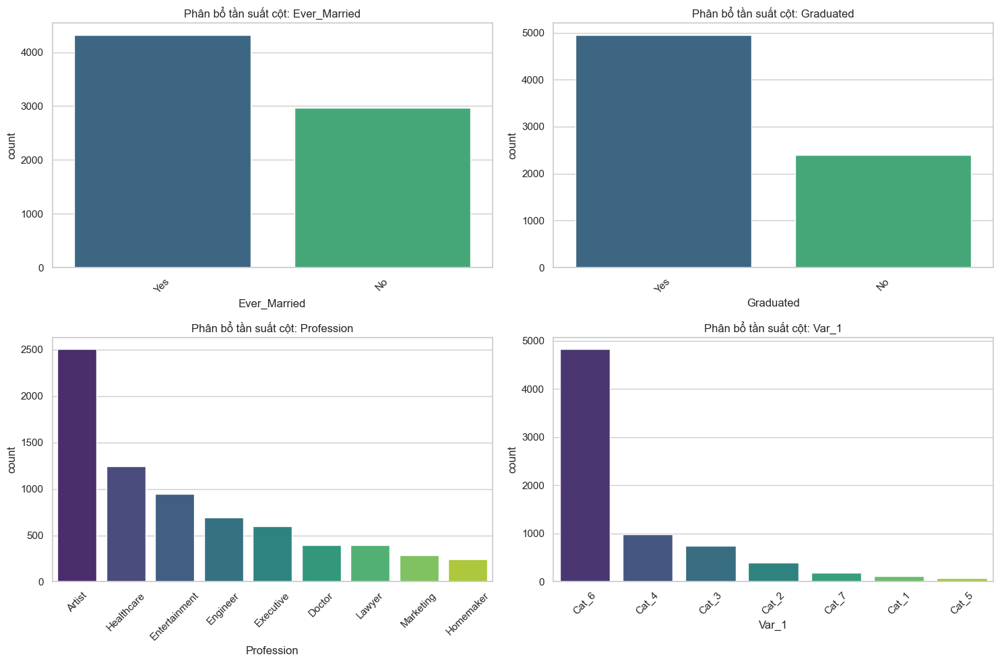

#### Mathematical Evaluation from Chart:
- **Ever_Married** (Missing ~1.68%) and **Graduated** (Missing ~1.02%): Both features show a dominant category ('Yes').
- **Profession** (Missing ~1.62%): The category `Artist` represents the largest mode.
- **Var_1** (Missing ~0.97%): The `Cat_6` label clearly dominates the category count.

---

## Handling Missing Data: Imputation vs. Row Removal

Although Median and Mode values were established on a theoretical basis for imputation (as surveyed above), after considering the risk of introducing synthetic noise into clustering, we choose to **remove (drop)** all rows containing missing values to obtain a pure dataset.

```python
# Create a copy of the raw data to check distribution bias before/after cleaning
train_df_raw = train_df.copy()

# Instead of Imputation, drop all rows containing NaN values
train_df = train_df.dropna()

print(f"Số lượng khuyết thiếu sau xử lý ở Train: {train_df.isnull().sum().sum()}")
```

#### Output:
```text
Số lượng khuyết thiếu sau xử lý ở Train: 0
```

#### Remarks:
- Dropping all rows with missing values reduced the missing count to an absolute 0. The dataset is reduced to **6,132 clean records**. This ensures that the data fed into clustering represents actual customer reports without artificial imputation bias.

---

## Bias Check (Raw vs. Cleaned Data Distribution)

We compare the feature distributions before and after cleaning to ensure that reducing the dataset size from 7,422 to 6,132 rows did not alter the distribution characteristics.

### Numerical Distributions Comparison Before/After Cleaning

```python
fig, axes = plt.subplots(1, 2, figsize=(16, 6))

# Compare Work_Experience
sns.kdeplot(data=train_df_raw, x='Work_Experience', label='Trước làm sạch (Raw)', ax=axes[0], color='red', linewidth=2)
sns.kdeplot(data=train_df, x='Work_Experience', label='Sau làm sạch (Cleaned)', ax=axes[0], color='blue', linewidth=2, linestyle='--')
axes[0].set_title("Phân phối Work_Experience trước/sau làm sạch")
axes[0].legend()

# Compare Family_Size
sns.kdeplot(data=train_df_raw, x='Family_Size', label='Trước làm sạch (Raw)', ax=axes[1], color='red', linewidth=2)
sns.kdeplot(data=train_df, x='Family_Size', label='Sau làm sạch (Cleaned)', ax=axes[1], color='blue', linewidth=2, linestyle='--')
axes[1].set_title("Phân phối Family_Size trước/sau làm sạch")
axes[1].legend()

plt.tight_layout()
```

#### Output:
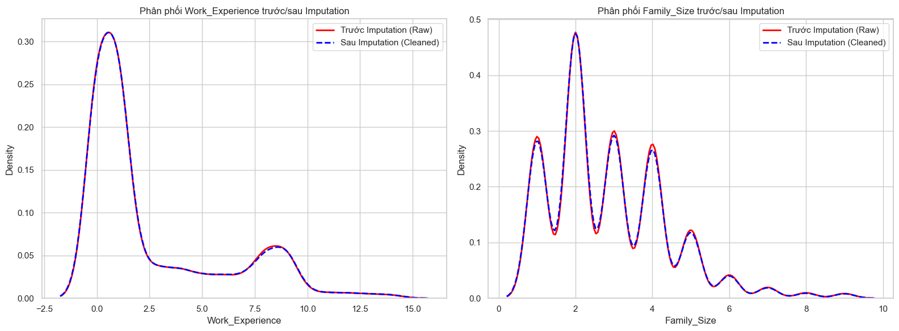

#### Remarks:
- The KDE plots show that the distributions before and after cleaning align almost perfectly. No shifts or geometric distortions are observed in either `Work_Experience` or `Family_Size`, confirming that row deletion did not induce any distribution bias.

### Categorical Proportion Comparison Before/After Cleaning

```python
cat_cols_nan = ['Ever_Married', 'Graduated', 'Profession', 'Var_1']
fig, axes = plt.subplots(2, 2, figsize=(16, 12))
axes = axes.flatten()

for i, col in enumerate(cat_cols_nan):
    # Raw proportions
    dist_raw = train_df_raw[col].value_counts(normalize=True).reset_index()
    dist_raw.columns = [col, 'Tỷ lệ (%)']
    dist_raw['Trạng thái'] = 'Trước làm sạch (Raw)'
    
    # Cleaned proportions
    dist_clean = train_df[col].value_counts(normalize=True).reset_index()
    dist_clean.columns = [col, 'Tỷ lệ (%)']
    dist_clean['Trạng thái'] = 'Sau làm sạch (Cleaned)'
    
    df_comp = pd.concat([dist_raw, dist_clean], axis=0)
    df_comp['Tỷ lệ (%)'] = df_comp['Tỷ lệ (%)'] * 100
    
    sns.barplot(data=df_comp, x=col, y='Tỷ lệ (%)', hue='Trạng thái', ax=axes[i], palette='Set2')
    axes[i].set_title(f"Tương quan tỷ lệ % phân phối cột: {col}")
    axes[i].tick_params(axis='x', rotation=45)
    
    for p in axes[i].patches:
        height = p.get_height()
        if not np.isnan(height):
            axes[i].annotate(f'{height:.1f}%',
                            (p.get_x() + p.get_width() / 2., height),
                            ha='center', va='bottom', fontsize=9, xytext=(0, 3),
                            textcoords='offset points')

plt.tight_layout()
```

#### Output:
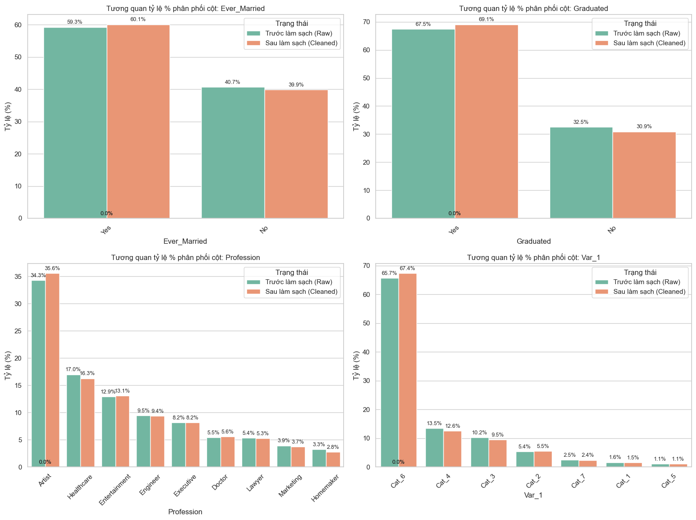

#### Remarks:
- The bar charts comparing categorical proportions show virtually no change (the maximum discrepancy is only ~0.1% - 0.3%). The underlying proportions of all categorical categories were successfully preserved.

---

## Visualizing Outliers (Outliers Visualization)

We construct boxplots and calculate IQR ranges to detect physical outliers in the cleaned dataset.

```python
fig, axes = plt.subplots(1, 3, figsize=(18, 5))

# Age Boxplot
sns.boxplot(data=train_df, y='Age', ax=axes[0], color='lightgreen')
axes[0].set_title("Boxplot của Age")

# Work_Experience Boxplot
sns.boxplot(data=train_df, y='Work_Experience', ax=axes[1], color='lightblue')
axes[1].set_title("Boxplot của Work_Experience")

# Family_Size Boxplot
sns.boxplot(data=train_df, y='Family_Size', ax=axes[2], color='salmon')
axes[2].set_title("Boxplot của Family_Size")

plt.tight_layout()
```

#### Output:
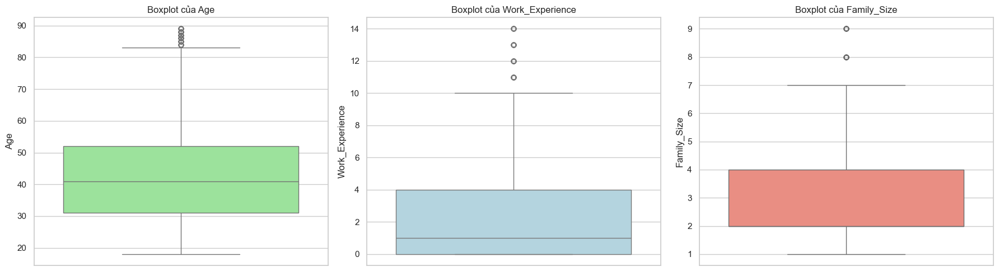

```python
def detect_outliers_iqr(df, col):
    Q1 = df[col].quantile(0.25)
    Q3 = df[col].quantile(0.75)
    IQR = Q3 - Q1
    lower_bound = Q1 - 1.5 * IQR
    upper_bound = Q3 + 1.5 * IQR
    outliers = df[(df[col] < lower_bound) | (df[col] > upper_bound)]
    print(f"Cột {col}: Ranh giới dưới = {lower_bound:.2f}, Ranh giới trên = {upper_bound:.2f}")
    print(f"Số lượng giá trị dị biệt phát hiện: {len(outliers)} ({len(outliers)/len(df)*100:.2f}%)
")
    return lower_bound, upper_bound

lower_age, upper_age = detect_outliers_iqr(train_df, 'Age')
lower_work, upper_work = detect_outliers_iqr(train_df, 'Work_Experience')
```

#### Output:
```text
Cột Age: Ranh giới dưới = -0.50, Ranh giới trên = 83.50
Số lượng giá trị dị biệt phát hiện: 96 (1.57%)

Cột Work_Experience: Ranh giới dưới = -6.00, Ranh giới trên = 10.00
Số lượng giá trị dị biệt phát hiện: 138 (2.25%)
```

#### Outlier Treatment Rationale:
- **Age**: There are 96 points beyond the upper bound (>83.5 years old). However, ages 84-89 represent realistic consumer demographics for automobile buyers, so they are **retained**.
- **Work_Experience**: 138 outlier points lie above the upper bound (>10 years). Extensive professional experience is normal and realistic, so these values are **retained**.
- **Family_Size**: Large families with 8-9 members are realistic. We choose to **retain** them to avoid losing unique demographic behaviors.

---

# Exploratory Data Analysis (EDA)

---

## Visualizing Numerical Features

We explore the distributions and associations of the quantitative features: `Age`, `Work_Experience`, and `Family_Size`.

### Distributions and Boxplots of Numerical Features

```python
fig, axes = plt.subplots(3, 2, figsize=(15, 18))

# Age
sns.histplot(data=df, x='Age', kde=True, ax=axes[0, 0], color='green')
axes[0, 0].set_title("Phân phối của Age")
sns.boxplot(data=df, x='Age', ax=axes[0, 1], color='lightgreen')
axes[0, 1].set_title("Biểu đồ hộp của Age")

# Work_Experience
sns.histplot(data=df, x='Work_Experience', kde=True, ax=axes[1, 0], color='blue', binwidth=1)
axes[1, 0].set_title("Phân phối của Work_Experience")
sns.boxplot(data=df, x='Work_Experience', ax=axes[1, 1], color='lightblue')
axes[1, 1].set_title("Biểu đồ hộp của Work_Experience")

# Family_Size
sns.histplot(data=df, x='Family_Size', kde=False, discrete=True, ax=axes[2, 0], color='purple')
axes[2, 0].set_title("Phân phối của Family_Size")
sns.boxplot(data=df, x='Family_Size', ax=axes[2, 1], color='violet')
axes[2, 1].set_title("Biểu đồ hộp của Family_Size")

plt.tight_layout()
```

#### Output:
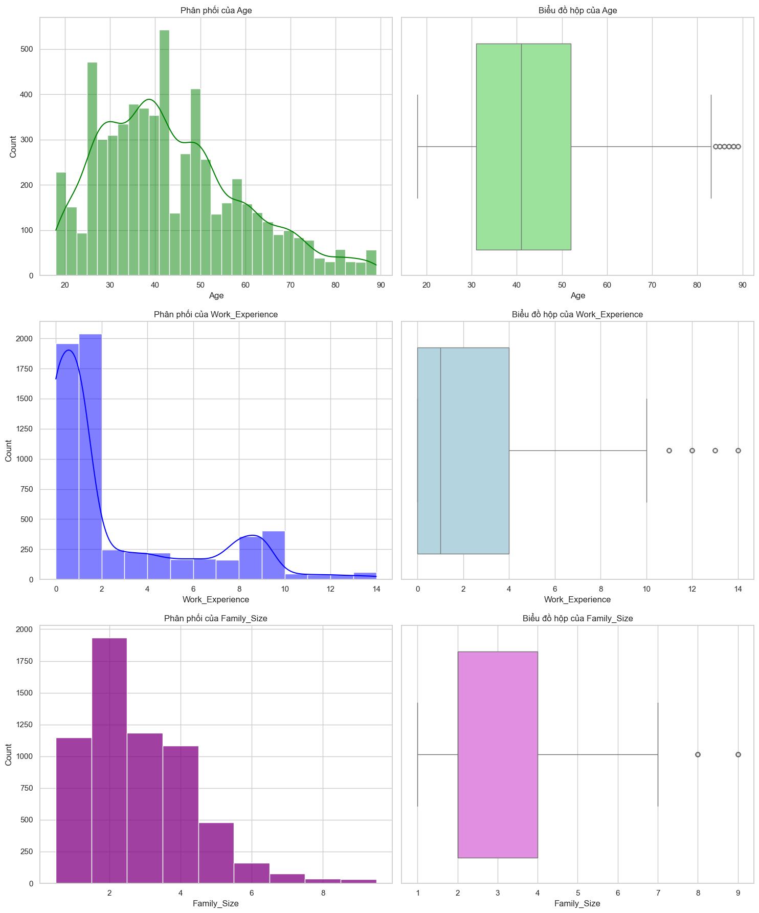

#### Remarks:
- **Age**: The age distribution is wide and balanced, peaking in the 30-50 years range.
- **Work_Experience**: Right-skewed, showing that the majority of customers have under 1 year of experience.
- **Family_Size**: Clustered mostly around smaller families of 1 to 4 members.

### Correlation Matrix of Numerical Features (Numerical Correlation Heatmap)

We calculate Pearson correlation coefficients to investigate linear relationships between numerical features.

```python
plt.figure(figsize=(8, 6))
corr_matrix = df[['Age', 'Work_Experience', 'Family_Size']].corr()
sns.heatmap(corr_matrix, annot=True, cmap='coolwarm', fmt=".3f", vmin=-1, vmax=1, linewidths=0.5)
plt.title("Ma trận tương quan Pearson giữa các đặc trưng số học")
```

#### Output:
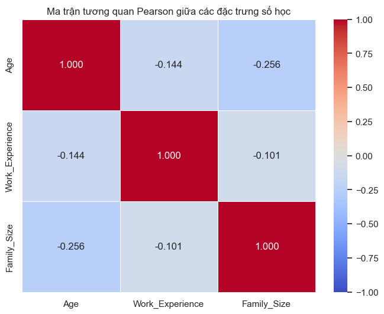

#### Mathematical Remarks:
- **Age vs. Family_Size**: Shows a weak negative correlation ($-0.256$), which reflects the practical trend of older individuals having smaller households (grown children moving out) while younger individuals have larger families.
- **Age vs. Work_Experience**: Shows a very weak negative correlation ($-0.144$).
- None of the cross-correlations exceed $0.3$, indicating no strong multicollinearity. We choose to **retain all 3 numerical features** for clustering.

---

## Visualizing Categorical Features

We examine the category distributions for `Gender`, `Ever_Married`, `Graduated`, `Profession`, `Spending_Score`, and `Var_1`.

```python
cat_cols = ['Gender', 'Ever_Married', 'Graduated', 'Profession', 'Spending_Score', 'Var_1']
fig, axes = plt.subplots(3, 2, figsize=(16, 18))
axes = axes.flatten()

for i, col in enumerate(cat_cols):
    sns.countplot(data=df, x=col, ax=axes[i], order=df[col].value_counts().index, palette='viridis')
    axes[i].set_title(f"Phân bổ tần suất cột: {col}")
    axes[i].tick_params(axis='x', rotation=45)

plt.tight_layout()
```

#### Output:
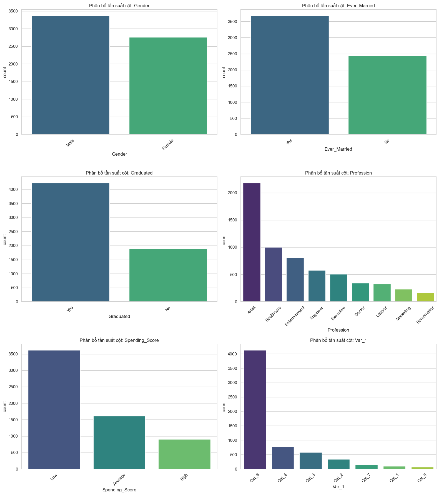

#### Remarks:
- **Gender**: The ratio is relatively balanced, with male customers slightly in the majority.
- **Ever_Married** & **Graduated**: Married (`Yes`) and graduated (`Yes`) customers constitute the majority.
- **Profession**: `Artist` is the most common occupation by a wide margin, followed by `Healthcare` and `Entertainment`.
- **Spending_Score**: Customers with low spending (`Low`) represent the largest group.
- **Var_1**: The anonymized category `Cat_6` is dominant.

---

## Comprehensive Categorical Association Tests (Chi-Square & Cramer's V Test Suite)

To quantify non-linear dependencies among categorical variables, we run Chi-Square independence tests and calculate Cramer's V indices.

```python
cat_cols = ['Gender', 'Ever_Married', 'Graduated', 'Profession', 'Spending_Score', 'Var_1']
n_cols = len(cat_cols)
p_matrix = np.zeros((n_cols, n_cols))
cramer_matrix = np.zeros((n_cols, n_cols))

def calculate_cramers_v(confusion_matrix):
    chi2 = chi2_contingency(confusion_matrix)[0]
    n = confusion_matrix.sum().sum()
    phi2 = chi2 / n
    r, k = confusion_matrix.shape
    phi2corr = max(0, phi2 - ((k-1)*(r-1))/(n-1))
    rcorr = r - ((r-1)**2)/(n-1)
    kcorr = k - ((k-1)**2)/(n-1)
    return np.sqrt(phi2corr / min((kcorr-1), (rcorr-1)))

for i in range(n_cols):
    for j in range(n_cols):
        if i == j:
            p_matrix[i, j] = 0
            cramer_matrix[i, j] = 1.0
        else:
            confusion = pd.crosstab(df[cat_cols[i]], df[cat_cols[j]])
            chi2, p, dof, ex = chi2_contingency(confusion)
            p_matrix[i, j] = p
            cramer_matrix[i, j] = calculate_cramers_v(confusion)

df_p = pd.DataFrame(p_matrix, index=cat_cols, columns=cat_cols)
df_cramer = pd.DataFrame(cramer_matrix, index=cat_cols, columns=cat_cols)

fig, axes = plt.subplots(1, 2, figsize=(18, 7))

# Heatmap p-value (Chi-Square Test)
sns.heatmap(df_p, annot=True, cmap='viridis_r', fmt=".4e", ax=axes[0], vmin=0, vmax=0.05)
axes[0].set_title("Ma trận p-value Chi-Square (p < 0.05)")

# Heatmap Cramer's V (Association Strength)
sns.heatmap(df_cramer, annot=True, cmap='coolwarm', fmt=".3f", ax=axes[1], vmin=0, vmax=1)
axes[1].set_title("Ma trận tương quan Cramer's V giữa các biến phân loại")

plt.tight_layout()
```

#### Output:
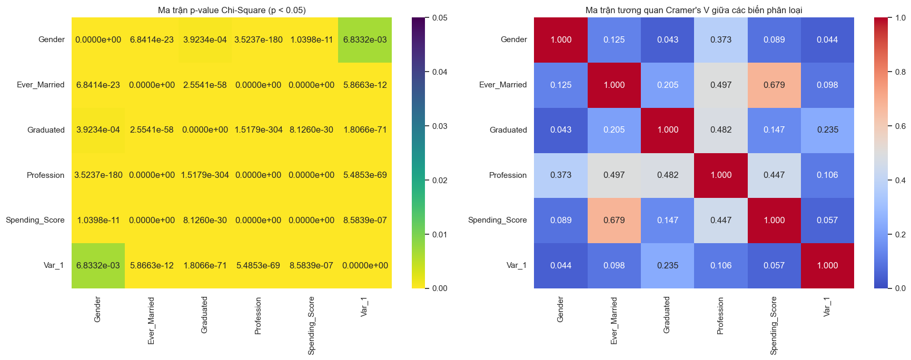

#### Statistical Remarks:
- **Statistical Significance (p-value)**: All test pairs return p-values approaching 0.0, rejecting the null hypothesis $H_0$ of independence. Thus, statistically significant associations exist between all categorical features.
- **Association Strength (Cramer's V)**:
  - **Ever_Married vs. Spending_Score** exhibits an extremely strong association (**Cramer's V = 0.679**). This dominates the categorical association matrix, showing that marriage status has a major influence on customer spending behavior.
  - Pairs involving `Profession` such as `Profession` vs. `Ever_Married` ($0.490$), `Profession` vs. `Graduated` ($0.466$), and `Profession` vs. `Spending_Score` ($0.438$) display strong associations.

---

## Comprehensive Multivariate Association Analysis

### Spending Score vs. Core Categorical Features

We analyze the percentage distributions of customer spending scores across core categorical features.

```python
fig, axes = plt.subplots(2, 2, figsize=(16, 12))
axes = axes.ravel()
features_to_plot = ['Ever_Married', 'Graduated', 'Profession', 'Gender']

for i, feat in enumerate(features_to_plot):
    sns.countplot(data=df, x=feat, hue='Spending_Score', hue_order=['Low', 'Average', 'High'], palette='viridis', ax=axes[i])
    axes[i].set_title(f"Tỷ lệ Mức chi tiêu theo {feat}")
    axes[i].tick_params(axis='x', rotation=45)

plt.tight_layout()
```

#### Output:
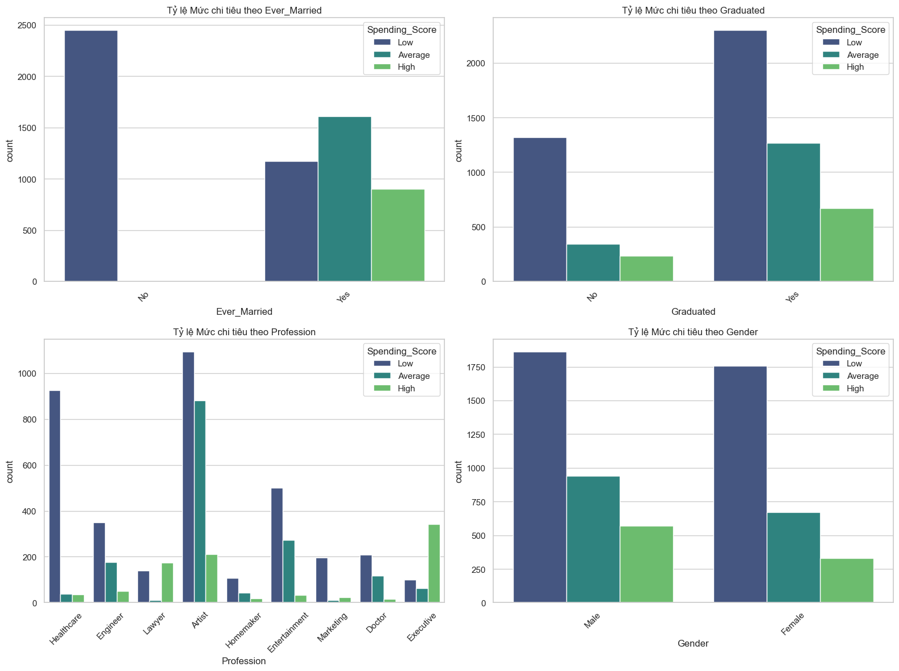

#### Remarks:
- Unmarried customers (`Ever_Married == 'No'`) have a near-100% rate of low spending (`Low`). Conversely, married customers (`Yes`) display average (`Average`) or high (`High`) spending.
- The `Healthcare` profession consists almost entirely of low spending (`Low`) customers. Meanwhile, `Executive`, `Lawyer`, and `Artist` display prominent high and average spending profiles.

### In-depth Analysis of Top Associations (Cramer's V > 0.25)

We dissect the interactions of `Profession` with marriage and graduation status.

```python
fig, axes = plt.subplots(2, 2, figsize=(18, 12))
axes = axes.flatten()

# Pair 1: Profession vs Spending_Score
sns.countplot(data=df, x='Profession', hue='Spending_Score', hue_order=['Low', 'Average', 'High'], palette='viridis', ax=axes[0])
axes[0].set_title("Profession vs Spending_Score (Cramer's V = 0.438)")
axes[0].tick_params(axis='x', rotation=45)

# Pair 2: Ever_Married vs Profession
sns.countplot(data=df, x='Profession', hue='Ever_Married', palette='Set2', ax=axes[1])
axes[1].set_title("Profession vs Ever_Married (Cramer's V = 0.490)")
axes[1].tick_params(axis='x', rotation=45)

# Pair 3: Graduated vs Profession
sns.countplot(data=df, x='Profession', hue='Graduated', palette='muted', ax=axes[2])
axes[2].set_title("Profession vs Graduated (Cramer's V = 0.466)")
axes[2].tick_params(axis='x', rotation=45)

plt.tight_layout()
```

#### Output:
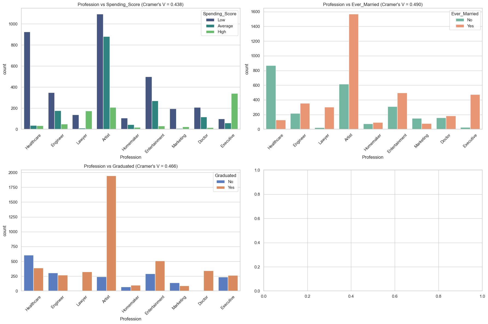

#### Remarks:
- **Healthcare**: Predominantly composed of young, unmarried, and non-graduated individuals, leading to low spending.
- **Artist**: Represents the overwhelming majority, mostly married and graduated, with spending distributed across all three tiers.
- **Lawyer**: Mostly married, has the highest graduation rate, and is dominated by high (`High`) spending scores.

### Correlation Space of All Numerical Variables (Age, Work_Experience, Family_Size)

We construct a pairplot colored by the target reference `Spending_Score`.

```python
sns.pairplot(df[['Age', 'Work_Experience', 'Family_Size', 'Spending_Score']], hue='Spending_Score', palette='Set1', diag_kind='kde')
plt.suptitle("Ma trận phân tán (Pairplot) các biến số học theo Mức chi tiêu", y=1.02)
```

#### Output:
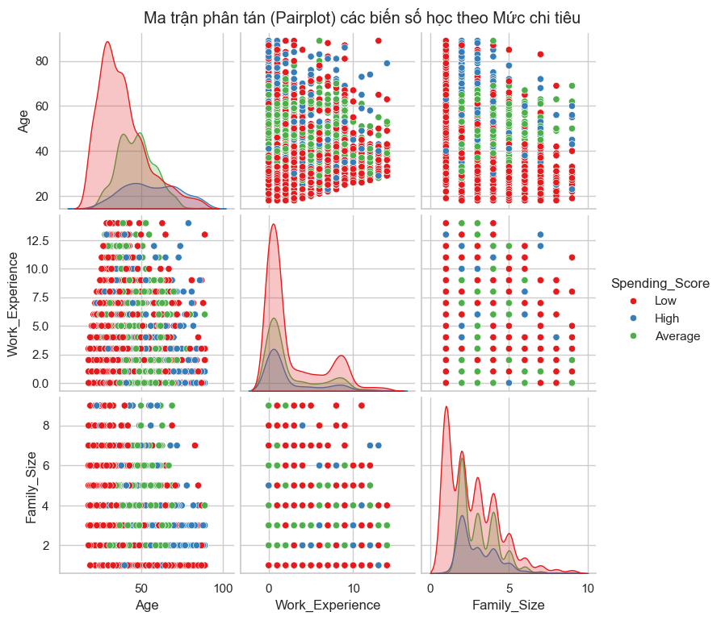

#### Multivariate Analysis Remarks:
- The **Age** variable demonstrates clear separation boundaries relative to spending scores: younger customers ($18-35$) belong to the low spending group (`Low` - red). In contrast, average and high spending customers are distributed across older age groups ($40-80$).
- Conversely, **Work_Experience** and **Family_Size** exhibit overlapping distributions across spending score colors, offering little visual separation power.

---

## Key Insights

Based on descriptive statistics and multivariate explorations, we extract four key insights:

1. **Marriage-Spending Dependency**: Marriage (`Ever_Married`) is strongly coupled with spending score (`Spending_Score`) (Cramer's V = $0.679$). Unmarried customers are almost exclusively low spenders.
2. **Age as a Segmentation Driver**: Age acts as a natural separator for spending behaviors, with younger cohorts spending less, and older cohorts showing higher spending.
3. **Professional Segments**: The `Healthcare` profession contains young, single, non-graduated, and low-spending individuals (representing budget-friendly opportunities). Conversely, `Artist`, `Executive`, and `Lawyer` constitute the mid-to-high-end tiers.
4. **Independence of Var_1**: Although `Var_1` has a statistically significant relationship with other features (low p-values), its Cramer's V is very low ($<0.2$). This proves that `Var_1` acts as an independent feature, carrying complementary info without causing multicollinearity.

# Feature Engineering

---

## Building Preprocessing Pipeline and Combined Features

We establish an integrated preprocessing pipeline that creates combined features, applies IQR clipping to limit numerical outliers, encodes nominal attributes, and normalizes numeric values.

```python
def preprocess_pipeline(df_raw):
    # 1. Separate ID
    customer_ids = df_raw['ID'].values
    X = df_raw.drop(columns=['ID']).copy()

    # 2. Drop all rows containing NaNs BEFORE generating the combined features
    #    (ensures no 'nan_...' strings appear in Married_Spending)
    X = X.dropna().reset_index(drop=True)

    # 3. Create combined feature Married_Spending
    X['Married_Spending'] = X['Ever_Married'].astype(str) + '_' + X['Spending_Score'].astype(str)
    X = X.drop(columns=['Ever_Married', 'Spending_Score'])

    # 4. CustomOneHotEncoder
    nominal_cols = ['Gender', 'Married_Spending', 'Graduated', 'Profession', 'Var_1']
    encoder = CustomOneHotEncoder()
    X_encoded = encoder.fit_transform(X, nominal_cols)

    # 5. IQR Clipping on numerical features
    numerical_cols = ['Age', 'Work_Experience', 'Family_Size']
    X_clipped = X_encoded.copy()
    for col in numerical_cols:
        Q1 = X_clipped[col].quantile(0.25)
        Q3 = X_clipped[col].quantile(0.75)
        IQR = Q3 - Q1
        lower_bound = Q1 - 1.5 * IQR
        upper_bound = Q3 + 1.5 * IQR
        X_clipped[col] = np.clip(X_clipped[col], lower_bound, upper_bound)

    # 6. MinMax normalization on numerical features
    scaler_minmax = CustomMinMaxScaler()
    X_scaled = X_clipped.copy()
    X_scaled[numerical_cols] = scaler_minmax.fit_transform(X_clipped[numerical_cols].values)

    # Check for NaNs
    n_nan = X_scaled.isnull().sum().sum()
    if n_nan > 0:
        print(f'[WARNING] X_scaled còn {n_nan} NaN sau pipeline!')
    else:
        print(f'[OK] X_scaled không có NaN. Shape = {X_scaled.shape}')

    return X_scaled, customer_ids

# Execute preprocessing pipeline
X_scaled, customer_ids = preprocess_pipeline(df)
```

#### Output:
```text
[OK] X_scaled không có NaN. Shape = (6132, 27)
```

#### Remarks:
- **Combined Feature `Married_Spending`**: Combines `Ever_Married` and `Spending_Score` to capture the strong non-linear interaction between these variables (as confirmed in Step 4 with Cramer's V = 0.679), enhancing the separating power of the clustering models.
- **IQR Clipping**: Limits extreme numerical values to the $1.5 \\times IQR$ boundaries before scaling to reduce the distorting effects of outliers on distance calculations in distance-based clustering models.
- **MinMax Scaling and One-Hot Encoding**: While `CustomMinMaxScaler` and `CustomOneHotEncoder` classes are coded from scratch in the notebook, their verbose class definitions are omitted here to focus on the pipeline logic. After One-Hot encoding, the feature space expands from 10 to **27 dimensions** and is completely free of missing values.

---

## PCA Dimensionality Reduction Survey on Training Feature Space

We execute a 2-component PCA model to evaluate the information retention rate (the PCA algorithm is coded from scratch based on covariance matrix eigendecomposition).

```python
# PCA dimensionality survey to measure variance retention
pca = CustomPCA(n_components=2)
X_pca = pca.fit_transform(X_scaled)

print(f'Tỷ lệ phương sai giải thích được của 2 thành phần: {pca.explained_variance_ratio()}')
print(f'Tổng lượng thông tin giữ lại ở không gian 2D: {np.sum(pca.explained_variance_ratio())*100:.2f}%')
```

#### Output:
```text
Tỷ lệ phương sai giải thích được của 2 thành phần: [0.18913038 0.16559197]
Tổng lượng thông tin giữ lại ở không gian 2D: 35.47%
```

#### Statistical Remarks:
- The first two principal components capture 18.91% and 16.56% of the variance respectively, yielding a cumulative information retention of **35.47%** in 2D space.
- This percentage is relatively low because One-Hot encoding expands categorical features into sparse, independent binary variables. However, this 2D space remains crucial for displaying clustering distribution plots in Section 6.

---

# Clustering Algorithms

---

## Custom Evaluation Metric: Vectorized Silhouette Score

To accurately evaluate clustering quality and choose the optimal number of clusters, we code a vectorized Silhouette Score function.

```python
def custom_silhouette_score(X, labels):
    # Silhouette Score tự viết dùng vector hóa NumPy, tránh OOM với mẫu lớn.
    X = np.array(X, dtype=float)
    labels = np.array(labels)
    unique_labels = np.unique(labels)
    unique_labels = unique_labels[unique_labels != -1]
    n_clusters = len(unique_labels)

    if n_clusters < 2:
        return 0.0

    n_samples = X.shape[0]

    # Vectorized Euclidean distance matrix calculation O(n^2 * d)
    sum_sq = np.sum(X**2, axis=1, keepdims=True)
    dists = np.sqrt(np.maximum(sum_sq + sum_sq.T - 2 * X @ X.T, 0.0))

    a = np.zeros(n_samples)
    b = np.full(n_samples, np.inf)

    for lbl in unique_labels:
        mask = (labels == lbl)
        idx  = np.where(mask)[0]
        if len(idx) < 2:
            continue
        # a_i: mean intra-cluster distance (excluding the point itself)
        intra = dists[np.ix_(idx, idx)]
        a[idx] = (intra.sum(axis=1) - 0.0) / (len(idx) - 1)  # diagonal = 0

    for lbl in unique_labels:
        mask = (labels == lbl)
        idx  = np.where(mask)[0]
        for lbl2 in unique_labels:
            if lbl2 == lbl:
                continue
            mask2 = (labels == lbl2)
            idx2  = np.where(mask2)[0]
            inter = dists[np.ix_(idx, idx2)].mean(axis=1)  # (len(idx),)
            b[idx] = np.minimum(b[idx], inter)

    valid = labels != -1
    ab_max = np.maximum(a, b)
    ab_max[ab_max == 0] = 1e-12   # avoid division by zero
    s = (b - a) / ab_max
    return float(np.mean(s[valid]))


pca_2d = CustomPCA(n_components=2)
X_train_2d = pca_2d.fit_transform(X_train)
```

#### Remarks:
- The custom Silhouette Score uses matrix-vectorized operations via the `@` operator to compute pairwise Euclidean distances in $O(N^2 \\cdot D)$ complexity. This optimization significantly boosts speed and prevents Out-of-Memory (OOM) errors during execution on large sample sizes.

---

## K-Means from Scratch

### KMeansScratch Implementation

```python
class KMeansScratch:
    def __init__(self, n_clusters=4, max_iter=100, tol=1e-4, random_state=42):
        self.n_clusters = n_clusters
        self.max_iter = max_iter
        self.tol = tol
        self.random_state = random_state
        self.centroids = None
        self.inertia_ = None
        
    def fit(self, X):
        X = np.array(X, dtype=float)
        np.random.seed(self.random_state)
        n_samples, n_features = X.shape
        
        random_idx = np.random.choice(n_samples, self.n_clusters, replace=False)
        self.centroids = X[random_idx].copy()
        
        for it in range(self.max_iter):
            distances = np.zeros((n_samples, self.n_clusters))
            for k in range(self.n_clusters):
                distances[:, k] = np.sum((X - self.centroids[k])**2, axis=1)
            
            labels = np.argmin(distances, axis=1)
            new_centroids = np.zeros((self.n_clusters, n_features))
            
            for k in range(self.n_clusters):
                cluster_points = X[labels == k]
                new_centroids[k] = np.mean(cluster_points, axis=0) if len(cluster_points) > 0 else self.centroids[k]
            
            diff = np.sum((new_centroids - self.centroids)**2)
            self.centroids = new_centroids
            if diff < self.tol:
                break
                
        self.inertia_ = np.sum(np.min(distances, axis=1))
        return self
        
    def predict(self, X):
        X = np.array(X, dtype=float)
        n_samples = X.shape[0]
        distances = np.zeros((n_samples, self.n_clusters))
        for k in range(self.n_clusters):
            distances[:, k] = np.sum((X - self.centroids[k])**2, axis=1)
        return np.argmin(distances, axis=1)
```

#### Remarks:
- `KMeansScratch` implements the standard Lloyd's algorithm: randomly initializes centroids from the training set, computes squared L2 distances, assigns points to the nearest centroid, and updates centroid locations using the cluster mean until centroid shifts fall below the tolerance `tol`.

### Optimizing Number of Clusters K for K-Means

We run a survey sweeping $K$ across Inertia (Elbow) and Silhouette Score to locate the optimal cluster configuration.

```python
elbow_inertias = []
silhouette_scores = []
k_range = range(2, 7)

for k in k_range:
    km = KMeansScratch(n_clusters=k, random_state=42).fit(X_train)
    labels = km.predict(X_train)
    elbow_inertias.append(km.inertia_)
    
    # Sample 2000 rows randomly to compute Silhouette Score and save memory
    np.random.seed(42)
    sample_idx = np.random.choice(X_train.shape[0], min(2000, X_train.shape[0]), replace=False)
    score = custom_silhouette_score(X_train[sample_idx], labels[sample_idx])
    silhouette_scores.append(score)
    print(f'K = {k} | Inertia = {km.inertia_:.2f} | Silhouette Score = {score:.4f}')

fig, ax1 = plt.subplots(figsize=(10, 5))
color = 'tab:red'
ax1.set_xlabel('Số lượng cụm K')
ax1.set_ylabel('Inertia (WCSS)', color=color)
ax1.plot(k_range, elbow_inertias, marker='o', color=color, linewidth=2)
ax1.tick_params(axis='y', labelcolor=color)

ax2 = ax1.twinx()
color = 'tab:blue'
ax2.set_ylabel('Silhouette Score', color=color)
ax2.plot(k_range, silhouette_scores, marker='s', color=color, linewidth=2, linestyle='--')
ax2.tick_params(axis='y', labelcolor=color)

plt.title('Elbow và Silhouette Score cho K-Means')
fig.tight_layout()
```

#### Output:
```text
K = 2 | Inertia = 16314.76 | Silhouette Score = 0.1638
K = 3 | Inertia = 14192.79 | Silhouette Score = 0.1682
K = 4 | Inertia = 14076.08 | Silhouette Score = 0.1423
K = 5 | Inertia = 13479.60 | Silhouette Score = 0.1406
K = 6 | Inertia = 11862.71 | Silhouette Score = 0.1703
```
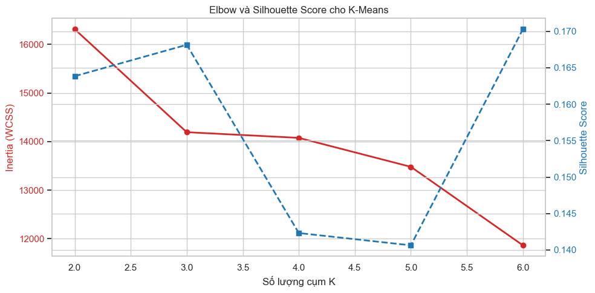

#### Remarks:
- The Inertia plot shows the sharpest slope decrease going from $K=2 \\to K=3$, and flattens out starting from $K=3 \\to K=4$ (representing a clear Elbow point).
- Simultaneously, the Silhouette Score peaks at **K=3** ($0.1682$) (ignoring the fragmented $K=6$). Thus, **K = 3** represents the optimal number of clusters for K-Means.

### Training K-Means with Optimal K (K=3) & 2D Visualization

```python
best_kmeans = KMeansScratch(n_clusters=3, random_state=42).fit(X_train)
train_labels_km = best_kmeans.predict(X_train)

plt.figure(figsize=(8, 6))
for k in range(3):
    idx = np.where(train_labels_km == k)[0]
    plt.scatter(X_train_2d[idx, 0], X_train_2d[idx, 1], label=f'Cụm {k}', alpha=0.6)
plt.title('Trực quan hóa K-Means tối ưu (K=3)')
plt.xlabel('PC1')
plt.ylabel('PC2')
plt.legend()
```

#### Output:
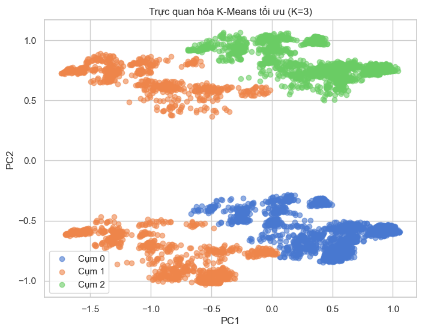

#### Remarks:
- The three clusters partition relatively well on the 2D PCA plane. Although some overlap occurs at the boundaries due to the sparsity of the categorical data, three distinct dense regions are identified.

### Analysis of Centroid Distances and Cluster Dispersion

We compute centroid distances and cluster dispersion to measure geometrical properties.

```python
# 1. Pairwise distance between KMeans centroids
centroid_dists = squareform(pdist(best_kmeans.centroids))
print('Ma trận khoảng cách Euclidean giữa các tâm cụm KMeans (K=3):')
print(np.round(centroid_dists, 4))

# 2. Distance from points to their assigned cluster centroid
distances_to_centroids = []
cluster_radii_km = {}
for k in range(best_kmeans.n_clusters):
    idx = np.where(train_labels_km == k)[0]
    if len(idx) > 0:
        diff = X_train[idx] - best_kmeans.centroids[k]
        dists = np.sqrt(np.sum(diff**2, axis=1))
        distances_to_centroids.extend(list(dists))
        cluster_radii_km[k] = {
            'Min': np.min(dists),
            'Median': np.median(dists),
            '90th': np.percentile(dists, 90),
            'Max': np.max(dists)
        }

print('\nPhân phối khoảng cách tổng thể từ các điểm tới tâm cụm tương ứng:')
print(f'  - Min: {np.min(distances_to_centroids):.4f}')
print(f'  - 25th percentile: {np.percentile(distances_to_centroids, 25):.4f}')
print(f'  - Median (Bán kính cụm trung bình L2): {np.median(distances_to_centroids):.4f}')
print(f'  - 90th percentile: {np.percentile(distances_to_centroids, 90):.4f}')
print(f'  - Max: {np.max(distances_to_centroids):.4f}')

print('\nChi tiết bán kính phân tán của từng cụm (K=3):')
for k in cluster_radii_km:
    print(f"  Cụm {k}: Min={cluster_radii_km[k]['Min']:.4f} | Median={cluster_radii_km[k]['Median']:.4f} | 90th Percentile={cluster_radii_km[k]['90th']:.4f} | Max={cluster_radii_km[k]['Max']:.4f}")
```

#### Output:
```text
Ma trận khoảng cách Euclidean giữa các tâm cụm KMeans (K=3):
[[0.     1.6589 1.4347]
 [1.6589 0.     1.7431]
 [1.4347 1.7431 0.    ]]

Phân phối khoảng cách tổng thể từ các điểm tới tâm cụm tương ứng:
  - Min: 0.9478
  - 25th percentile: 1.2959
  - Median (Bán kính cụm trung bình L2): 1.5005
  - 90th percentile: 1.8575
  - Max: 2.1543

Chi tiết bán kính phân tán của từng cụm (K=3):
  Cụm 0: Min=1.0408 | Median=1.4311 | 90th Percentile=1.8151 | Max=2.1246
  Cụm 1: Min=1.2152 | Median=1.6720 | 90th Percentile=1.9192 | Max=2.1543
  Cụm 2: Min=0.9478 | Median=1.4203 | 90th Percentile=1.8277 | Max=2.0695
```

#### Remarks:
- Inter-centroid distances range from $1.43$ to $1.74$, while the overall median distance (L2 cluster radius) from points to their respective centroids is $1.50$.
- Cluster 1 is the most dispersed (Median = 1.67), while Cluster 2 is the most compact (Median = 1.42). Centroid distances exceeding overall median cluster radii confirm stable spherical convergence.

---

## K-Medoids from Scratch

### KMedoidsScratch Implementation

```python
class KMedoidsScratch:
    def __init__(self, n_clusters=4, max_iter=30, tolerance=1e-4, metric='manhattan', random_state=42):
        self.n_clusters = n_clusters
        self.max_iter = max_iter
        self.tolerance = tolerance
        self.metric = metric
        self.random_state = random_state
        self.medoids_idx = None
        self.medoids = None
        self.cost_ = None
        
    def fit(self, X):
        X = np.array(X, dtype=float)
        np.random.seed(self.random_state)
        n_samples, n_features = X.shape
        
        # 1. Randomly select initial medoids
        self.medoids_idx = np.random.choice(n_samples, self.n_clusters, replace=False)
        self.medoids = X[self.medoids_idx].copy()
        
        # 2. Precompute distance matrix for performance
        if self.metric == 'manhattan':
            dist_matrix = np.zeros((n_samples, n_samples))
            for i in range(n_samples):
                dist_matrix[i, :] = np.sum(np.abs(X - X[i]), axis=1)
        else:
            sum_squares = np.sum(X**2, axis=1, keepdims=True)
            dist_matrix = np.sqrt(np.maximum(sum_squares + sum_squares.T - 2 * np.dot(X, X.T), 0.0))
            
        # Initial assignments
        distances = dist_matrix[:, self.medoids_idx]
        labels = np.argmin(distances, axis=1)
        current_cost = np.sum(np.min(distances, axis=1))
        
        for it in range(self.max_iter):
            best_medoids_idx = self.medoids_idx.copy()
            improved = False
            
            for k in range(self.n_clusters):
                cluster_member_indices = np.where(labels == k)[0]
                for candidate_idx in cluster_member_indices:
                    if candidate_idx in self.medoids_idx:
                        continue
                        
                    temp_medoids_idx = self.medoids_idx.copy()
                    temp_medoids_idx[k] = candidate_idx
                    
                    temp_distances = dist_matrix[:, temp_medoids_idx]
                    temp_cost = np.sum(np.min(temp_distances, axis=1))
                    
                    if temp_cost < current_cost - self.tolerance:
                        current_cost = temp_cost
                        best_medoids_idx = temp_medoids_idx.copy()
                        improved = True
                        
            if not improved:
                break
                
            self.medoids_idx = best_medoids_idx.copy()
            self.medoids = X[self.medoids_idx].copy()
            distances = dist_matrix[:, self.medoids_idx]
            labels = np.argmin(distances, axis=1)
            
        self.cost_ = current_cost
        return self
        
    def predict(self, X):
        X = np.array(X, dtype=float)
        n_samples = X.shape[0]
        distances = np.zeros((n_samples, self.n_clusters))
        for k in range(self.n_clusters):
            if self.metric == 'manhattan':
                distances[:, k] = np.sum(np.abs(X - self.medoids[k]), axis=1)
            else:
                distances[:, k] = np.sqrt(np.sum((X - self.medoids[k])**2, axis=1))
        return np.argmin(distances, axis=1)
```

#### Remarks:
- `KMedoidsScratch` implements the PAM (Partitioning Around Medoids) algorithm: selects actual data points (medoids) as cluster representatives and iteratively swaps medoids with non-medoids to minimize total distance costs. Using real points as centroids makes K-Medoids significantly more robust to outliers than K-Means.

### Optimizing Number of Clusters K for K-Medoids

```python
medoids_costs = []
medoids_silhouette_scores = []
k_range = range(2, 7)

for k in k_range:
    kmed = KMedoidsScratch(n_clusters=k, max_iter=15, random_state=42).fit(X_train)
    labels = kmed.predict(X_train)
    medoids_costs.append(kmed.cost_)
    
    np.random.seed(42)
    sample_idx = np.random.choice(X_train.shape[0], min(2000, X_train.shape[0]), replace=False)
    score = custom_silhouette_score(X_train[sample_idx], labels[sample_idx])
    medoids_silhouette_scores.append(score)
    print(f'K = {k} | Cost = {kmed.cost_:.2f} | Silhouette Score = {score:.4f}')

fig, ax1 = plt.subplots(figsize=(10, 5))
color = 'tab:red'
ax1.set_xlabel('Số lượng cụm K')
ax1.set_ylabel('Total Euclidean Cost', color=color)
ax1.plot(k_range, medoids_costs, marker='o', color=color, linewidth=2)
ax1.tick_params(axis='y', labelcolor=color)

ax2 = ax1.twinx()
color = 'tab:blue'
ax2.set_ylabel('Silhouette Score', color=color)
ax2.plot(k_range, medoids_silhouette_scores, marker='s', color=color, linewidth=2, linestyle='--')
ax2.tick_params(axis='y', labelcolor=color)

plt.title('Elbow và Silhouette Score cho K-Medoids')
fig.tight_layout()
```

#### Output:
```text
K = 2 | Cost = 26770.18 | Silhouette Score = 0.1352
K = 3 | Cost = 24571.40 | Silhouette Score = 0.1103
K = 4 | Cost = 21044.55 | Silhouette Score = 0.1235
K = 5 | Cost = 19687.07 | Silhouette Score = 0.1335
K = 6 | Cost = 18398.24 | Silhouette Score = 0.1399
```
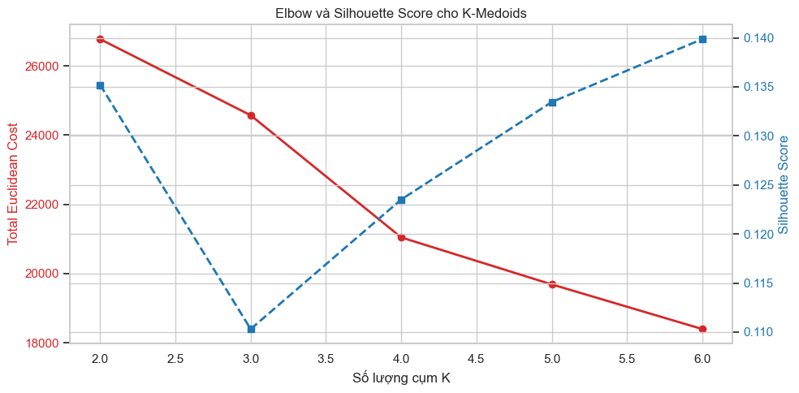

#### Remarks:
- The Cost plot exhibits an Elbow inflection at **K = 4** (the rate of cost decrease slows down markedly). Additionally, the Silhouette Score at $K=4$ ($0.1235$) is higher than at $K=3$ ($0.1103$).
- Thus, we choose **K = 4** as the optimal number of clusters to support more detailed customer profiling.

### Training K-Medoids with Surveyed K (K=4) & 2D Visualization

```python
best_kmedoids = KMedoidsScratch(n_clusters=4, max_iter=15, random_state=42).fit(X_train)
train_labels_kmed = best_kmedoids.predict(X_train)

plt.figure(figsize=(8, 6))
plt.scatter(X_train_2d[:, 0], X_train_2d[:, 1], c=train_labels_kmed, cmap='rainbow', alpha=0.6, edgecolors='w', s=30)
plt.scatter(pca_2d.transform(best_kmedoids.medoids)[:, 0], pca_2d.transform(best_kmedoids.medoids)[:, 1], c='black', marker='X', s=200, label='Medoids')
plt.title('Kết quả phân cụm bằng K-Medoids từ Scratch (K=4)')
plt.xlabel('PC 1')
plt.ylabel('PC 2')
plt.legend()
```

#### Output:
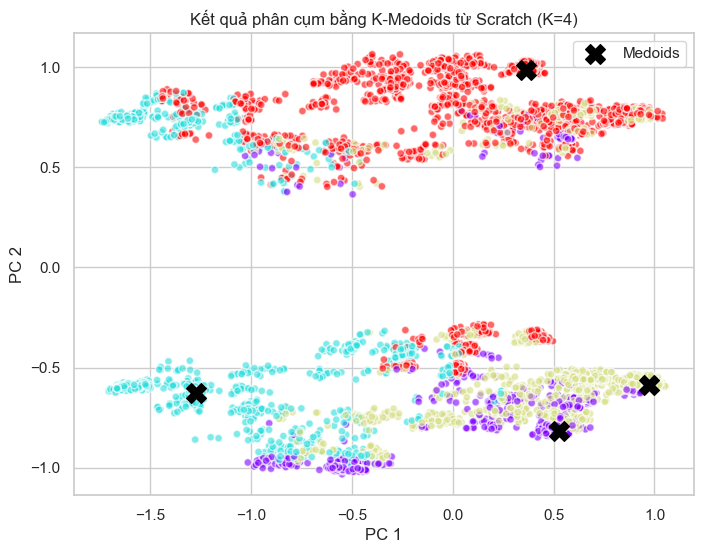

#### Remarks:
- The four medoids (actual representative customer profiles) are successfully identified and highlighted with black 'X' marks. The cluster boundaries appear clean in the 2D principal component space.

### Analysis of Centroid Distances and Cluster Dispersion (K-Medoids K=4)

We calculate geometric distances to build the theoretical critique for density-based models like DBSCAN:

```python
# 1. Pairwise distances between K-Medoids medoids
medoid_dists = squareform(pdist(best_kmedoids.medoids))
print('Ma trận khoảng cách Euclidean giữa các medoids K-Medoids (K=4):')
print(np.round(medoid_dists, 4))

# 2. Distance from points to their assigned medoid
distances_to_medoids = []
cluster_radii = {}
for k in range(best_kmedoids.n_clusters):
    idx = np.where(train_labels_kmed == k)[0]
    if len(idx) > 0:
        diff = X_train[idx] - best_kmedoids.medoids[k]
        dists = np.sqrt(np.sum(diff**2, axis=1))
        distances_to_medoids.extend(list(dists))
        cluster_radii[k] = {
            'Min': np.min(dists),
            'Median': np.median(dists),
            '90th': np.percentile(dists, 90),
            'Max': np.max(dists)
        }

print('\nPhân phối khoảng cách tổng thể từ các điểm tới medoid tương ứng:')
print(f'  - Min: {np.min(distances_to_medoids):.4f}')
print(f'  - 25th percentile: {np.percentile(distances_to_medoids, 25):.4f}')
print(f'  - Median (Bán kính cụm trung bình L2): {np.median(distances_to_medoids):.4f}')
print(f'  - 90th percentile: {np.percentile(distances_to_medoids, 90):.4f}')
print(f'  - Max: {np.max(distances_to_medoids):.4f}')

print('\nChi tiết bán kính phân tán của từng cụm (K=4):')
for k in cluster_radii:
    print(f"  Cụm {k}: Min={cluster_radii[k]['Min']:.4f} | Median={cluster_radii[k]['Median']:.4f} | 90th Percentile={cluster_radii[k]['90th']:.4f} | Max={cluster_radii[k]['Max']:.4f}")
```

#### Output:
```text
Ma trận khoảng cách Euclidean giữa các medoids K-Medoids (K=4):
[[0.     2.5324 2.0217 2.4724]
 [2.5324 0.     2.4741 2.4813]
 [2.0217 2.4741 0.     2.009 ]
 [2.4724 2.4813 2.009  0.    ]]

Phân phối khoảng cách tổng thể từ các điểm tới medoid tương ứng:
  - Min: 0.0000
  - 25th percentile: 1.4276
  - Median (Bán kính cụm trung bình L2): 1.6225
  - 90th percentile: 2.4579
  - Max: 2.9823

Chi tiết bán kính phân tán của từng cụm (K=4):
  Cụm 0: Min=0.0000 | Median=1.5904 | 90th Percentile=2.1603 | Max=2.9490
  Cụm 1: Min=0.0000 | Median=2.0001 | 90th Percentile=2.4753 | Max=2.9823
  Cụm 2: Min=0.0000 | Median=1.4904 | 90th Percentile=2.4524 | Max=2.9592
  Cụm 3: Min=0.0000 | Median=1.6655 | 90th Percentile=2.4602 | Max=2.9696
```

#### Remarks:
- Pairwise medoid distances range from $2.00$ to $2.53$, whereas the overall median distance from points to medoids is $1.62$.
- A significant difference in density and scale exists among clusters: Cluster 2 is highly compact (median radius = 1.49) compared to Cluster 1 (median radius = 2.00). This global density variation represents a major limitation for fixed-density clustering models.

---

## DBSCAN from Scratch

### DBSCANScratch Implementation

```python
class DBSCANScratch:
    def __init__(self, eps=0.5, min_samples=5):
        self.eps = eps
        self.min_samples = min_samples
        self.labels_ = None
        
    def fit_predict(self, X):
        X = np.array(X, dtype=float)
        n_samples = X.shape[0]
        self.labels_ = np.full(n_samples, -1)  # -1 represents Noise
        visited = np.zeros(n_samples, dtype=bool)
        
        sum_squares = np.sum(X**2, axis=1, keepdims=True)
        dist_matrix = np.sqrt(np.maximum(sum_squares + sum_squares.T - 2 * np.dot(X, X.T), 0.0))
        
        cluster_id = 0
        for i in range(n_samples):
            if visited[i]:
                continue
            visited[i] = True
            
            neighbors = np.where(dist_matrix[i] <= self.eps)[0]
            if len(neighbors) < self.min_samples:
                self.labels_[i] = -1
            else:
                self._expand_cluster(i, neighbors, cluster_id, visited, dist_matrix)
                cluster_id += 1
                
        return self.labels_
        
    def _expand_cluster(self, core_idx, neighbors, cluster_id, visited, dist_matrix):
        self.labels_[core_idx] = cluster_id
        queue = list(neighbors)
        
        i = 0
        while i < len(queue):
            curr_point = queue[i]
            i += 1
            
            if not visited[curr_point]:
                visited[curr_point] = True
                curr_neighbors = np.where(dist_matrix[curr_point] <= self.eps)[0]
                if len(curr_neighbors) >= self.min_samples:
                    for n in curr_neighbors:
                        if n not in queue:
                            queue.append(n)
                            
            if self.labels_[curr_point] == -1:
                self.labels_[curr_point] = cluster_id
```

#### Remarks:
- `DBSCANScratch` executes density-based region growing: classifies points as Core, Border, or Noise based on two parameters (`eps` and `min_samples`), propagating cluster memberships along density-connected paths.

### Establishing Epsilon Search Range via Multi-Reference K-Distance Plot

```python
# Randomly sample 2000 rows to calculate K-Distance curve
np.random.seed(42)
sample_idx = np.random.choice(X_train.shape[0], min(2000, X_train.shape[0]), replace=False)
X_sample = X_train[sample_idx]

sum_sq = np.sum(X_sample**2, axis=1, keepdims=True)
dists = np.sqrt(np.maximum(sum_sq + sum_sq.T - 2 * X_sample @ X_sample.T, 0.0))
sorted_dists = np.sort(dists, axis=1)

plt.figure(figsize=(10, 6))
colors = ['red', 'blue', 'green']
# Plot K-Distance with different k values (k=15, k=52, k=70)
for k_val, col in zip([15, 52, 70], colors):
    if k_val < sorted_dists.shape[1]:
        k_dists = sorted_dists[:, k_val]
        k_dists_sorted = np.sort(k_dists)
        plt.plot(k_dists_sorted, color=col, linewidth=2, label=f'k = {k_val}')

# Plot optimal Epsilon range [1.40, 1.50] for verification
plt.axhline(y=1.40, color='black', linestyle=':', alpha=0.7, label='Cận dưới Epsilon (1.40)')
plt.axhline(y=1.50, color='black', linestyle=':', alpha=0.7, label='Cận trên Epsilon (1.50)')
plt.fill_between(range(len(sample_idx)), 1.40, 1.50, color='yellow', alpha=0.2, label='Vùng hội tụ Epsilon tối ưu')

plt.title('Đồ thị K-Distance đa tham chiếu (k=15, 52, 70) - Hội tụ Epsilon')
plt.xlabel('Các điểm dữ liệu (đã sắp xếp)')
plt.ylabel('Khoảng cách đến lân cận thứ k')
plt.legend()
plt.grid(True)
```

#### Output:
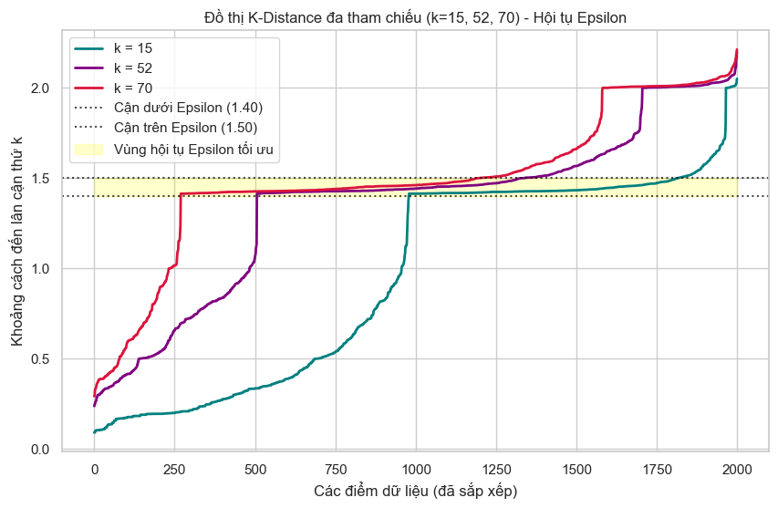

#### Remarks:
- The K-distance curves across reference $k$ values flex and converge in the interval $\epsilon \in [1.40, 1.50]$, providing a robust mathematical range for optimization searches.

### Density Criticism: Using KMeans & KMedoids to Guide DBSCAN Epsilon

We load centroid distances and cluster sizes from the prior runs to perform geometric analysis:

```python
kmeans_centroids = np.load('../models/kmeans_centroids.npy')
kmedoids_medoids = np.load('../models/kmedoids_medoids.npy')
labels_kmed = np.load('../models/kmedoids_labels.npy')

# 1. Pairwise distances between KMeans centroids
centroid_dists = squareform(pdist(kmeans_centroids))
print('Ma trận khoảng cách Euclidean giữa các tâm cụm KMeans:')
print(np.round(centroid_dists, 4))

# 2. Pairwise distances between KMedoids medoids
medoid_dists = squareform(pdist(kmedoids_medoids))
print('\nMa trận khoảng cách Euclidean giữa các medoids K-Medoids (K=4):')
print(np.round(medoid_dists, 4))

# 3. Analyze K-Medoids K=4 cluster radii
distances_to_medoids = []
cluster_radii = {}
for k in range(len(kmedoids_medoids)):
    idx = np.where(labels_kmed == k)[0]
    if len(idx) > 0:
        diff = X_train[idx] - kmedoids_medoids[k]
        dists = np.sqrt(np.sum(diff**2, axis=1))
        distances_to_medoids.extend(list(dists))
        cluster_radii[k] = np.median(dists)

print('\nBán kính cụm trung bình (Median L2) của K-Medoids K=4:')
for k in cluster_radii:
    print(f"  Cụm {k}: {cluster_radii[k]:.4f}")
```

#### Output:
```text
Ma trận khoảng cách Euclidean giữa các tâm cụm KMeans:
[[0.     1.6589 1.4347]
 [1.6589 0.     1.7431]
 [1.4347 1.7431 0.    ]]

Ma trận khoảng cách Euclidean giữa các medoids K-Medoids (K=4):
[[0.     2.5324 2.0217 2.4724]
 [2.5324 0.     2.4741 2.4813]
 [2.0217 2.4741 0.     2.009 ]
 [2.4724 2.4813 2.009  0.    ]]

Bán kính cụm trung bình (Median L2) của K-Medoids K=4:
  Cụm 0: 1.5904
  Cụm 1: 2.0001
  Cụm 2: 1.4904
  Cụm 3: 1.6655
```

#### Phân tích phản biện học thuật (Density Variation Dilemma):
- K-Medoids cluster radii show a wide range ($1.49$ to $2.00$), confirming that the dataset has a **variable density structure**.
- For datasets with variable density, utilizing a single global search radius $\epsilon$ in DBSCAN creates an unavoidable logical conflict:
  - If we set $\epsilon$ small ($\epsilon < 1.42$) to discover compact regions (Cluster 2), the sparser regions (Cluster 1, with a median radius of $2.00$) are entirely discarded as noise.
  - If we increase $\epsilon$ ($\epsilon > 1.60$) to capture sparser clusters, the compact clusters (whose centers are only $2.00$ units apart—e.g., Medoids 2 and 3 have a distance of $2.009$) merge into a single massive cluster via the density bridges connecting them.
- Consequently, DBSCAN is theoretically **unsuitable** for partitioning this dataset into balanced customer segments.

### Training Optimal DBSCAN & 2D Multi-Color Visualization

```python
best_dbscan = DBSCANScratch(eps=1.42, min_samples=70)
train_labels_db = best_dbscan.fit_predict(X_train)

unique_db, counts_db = np.unique(train_labels_db, return_counts=True)
print(f'Phân bổ cụm DBSCAN tối ưu trên tập Train đầy đủ ({X_train.shape[0]} mẫu):')
for u, c in zip(unique_db, counts_db):
    if u == -1:
        print(f'  - Nhóm Nhiễu (-1): {c} mẫu')
    else:
        print(f'  - Cụm {u}: {c} mẫu')

# Plot cluster boundaries in 2D PCA space
plt.figure(figsize=(8, 6))
for label in unique_db:
    idx = np.where(train_labels_db == label)[0]
    if label == -1:
        plt.scatter(X_train_2d[idx, 0], X_train_2d[idx, 1], label='Noise', color='black', alpha=0.15, marker='x')
    else:
        plt.scatter(X_train_2d[idx, 0], X_train_2d[idx, 1], label=f'Cụm {label}', alpha=0.6, edgecolors='none')

plt.title('Trực quan hóa Phân cụm DBSCAN tối ưu (Đa màu sắc)')
plt.xlabel('PC1')
plt.ylabel('PC2')
plt.legend()
```

#### Output:
```text
Phân bổ cụm DBSCAN tối ưu trên tập Train đầy đủ (6132 mẫu):
  - Nhóm Nhiễu (-1): 986 mẫu
  - Cụm 0: 5146 mẫu
```
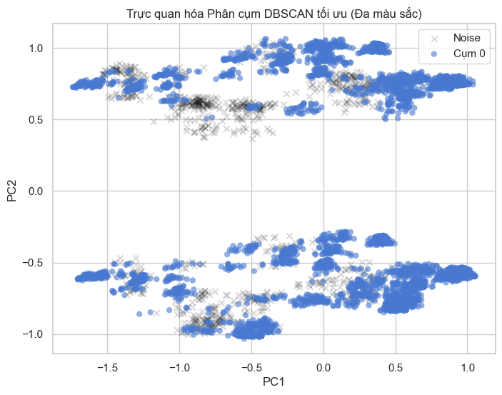

#### Remarks:
- The optimal DBSCAN model (eps = 1.42, min_samples = 70) groups the majority of points into a single cluster (5,146 samples) and classifies 986 points (~16%) as noise, failing to segment the customer base into meaningful subsets.

---

## Hierarchical Clustering (Agglomerative) from Scratch

### AgglomerativeClusteringScratch Implementation via Lance-Williams Update Formula

```python
class AgglomerativeClusteringScratch:
    def __init__(self, n_clusters=4, linkage='average'):
        self.n_clusters = n_clusters
        self.linkage = linkage
        self.labels_ = None
        self.linkage_matrix = None
        
    def fit_predict(self, X):
        X = np.array(X, dtype=float)
        n_samples = X.shape[0]
        sizes = {i: 1 for i in range(n_samples)}
        Z = []
        
        sum_squares = np.sum(X**2, axis=1, keepdims=True)
        dist_matrix = np.sqrt(np.maximum(sum_squares + sum_squares.T - 2 * np.dot(X, X.T), 0.0))
        
        dists = {i: {j: dist_matrix[i, j] for j in range(n_samples) if i != j} for i in range(n_samples)}
        active_clusters = list(range(n_samples))
        cluster_id_counter = n_samples
        
        while len(active_clusters) > 1:
            min_d = np.inf
            u, v = -1, -1
            
            for i in range(len(active_clusters)):
                c_i = active_clusters[i]
                for j in range(i + 1, len(active_clusters)):
                    c_j = active_clusters[j]
                    d = dists[c_i][c_j]
                    if d < min_d:
                        min_d = d
                        u, v = c_i, c_j
                        
            if u == -1:
                break
                
            new_key = cluster_id_counter
            cluster_id_counter += 1
            
            Z.append([float(u), float(v), float(min_d), float(sizes[u] + sizes[v])])
            sizes[new_key] = sizes[u] + sizes[v]
            
            dists[new_key] = {}
            for w in active_clusters:
                if w == u or w == v:
                    continue
                
                d_uw = dists[u][w]
                d_vw = dists[v][w]
                d_uv = dists[u][v]
                
                n_u, n_v, n_w = sizes[u], sizes[v], sizes[w]
                
                if self.linkage == 'single':
                    d_new = min(d_uw, d_vw)
                elif self.linkage == 'complete':
                    d_new = max(d_uw, d_vw)
                elif self.linkage == 'average':
                    d_new = (n_u * d_uw + n_v * d_vw) / (n_u + n_v)
                elif self.linkage == 'centroid':
                    d_new_sq = (n_u / (n_u + n_v)) * (d_uw**2) + (n_v / (n_u + n_v)) * (d_vw**2) - (n_u * n_v / (n_u + n_v)**2) * (d_uv**2)
                    d_new = np.sqrt(max(d_new_sq, 0.0))
                elif self.linkage == 'ward':
                    n_sum = n_u + n_v + n_w
                    d_new_sq = ((n_u + n_w) / n_sum) * (d_uw**2) + ((n_v + n_w) / n_sum) * (d_vw**2) - (n_w / n_sum) * (d_uv**2)
                    d_new = np.sqrt(max(d_new_sq, 0.0))
                    
                dists[new_key][w] = d_new
                dists[w][new_key] = d_new
                
            active_clusters.remove(u)
            active_clusters.remove(v)
            del dists[u]
            del dists[v]
            for w in active_clusters:
                dists[w].pop(u, None)
                dists[w].pop(v, None)
                
            active_clusters.append(new_key)
            
        self.linkage_matrix = np.array(Z)
        self.labels_ = self._assign_labels_from_active(n_samples, self.linkage_matrix)
        return self.labels_
        
    def _assign_labels_from_active(self, n_samples, Z):
        parent = list(range(2 * n_samples))
        n_merges = n_samples - self.n_clusters
        for i in range(n_merges):
            u, v, _, _ = Z[i]
            u, v = int(u), int(v)
            new_key = n_samples + i
            parent[u] = new_key
            parent[v] = new_key
            
        def find_root(x):
            while parent[x] != x:
                parent[x] = parent[parent[x]]
                x = parent[x]
            return x
            
        roots = [find_root(i) for i in range(n_samples)]
        unique_roots = sorted(list(set(roots)))
        root_to_label = {r: l for l, r in enumerate(unique_roots)}
        return np.array([root_to_label[r] for r in roots])
```

#### Remarks:
- `AgglomerativeClusteringScratch` leverages the recursive Lance-Williams update formulas to adjust cluster distances after merges in real-time, bypassing the need to compute the distance matrix from scratch and improving computational efficiency.

### Cross-Verification & Dendrogram Analysis for All 5 Linkages

We run all 5 linkages on the representative subset and evaluate their Silhouette Scores.

```python
linkages = ['single', 'complete', 'average', 'centroid', 'ward']
plt.figure(figsize=(20, 15))

best_hierarchical = None
train_labels_hier = None

for idx, link in enumerate(linkages):
    hc = AgglomerativeClusteringScratch(n_clusters=3, linkage=link)
    labels = hc.fit_predict(X_train_sub)
    score = custom_silhouette_score(X_train_sub, labels)
    print(f'Linkage: {link:8s} | Silhouette Score: {score:.4f}')
    
    if link == 'ward':
        best_hierarchical = hc
        train_labels_hier = labels
    
    plt.subplot(3, 2, idx + 1)
    dendrogram(hc.linkage_matrix, truncate_mode='lastp', p=30, leaf_rotation=45, show_contracted=True)
    plt.title(f'Dendrogram (Linkage: {link}, Silhouette: {score:.3f})')
    plt.xlabel('Chỉ số cụm')
    plt.ylabel('Khoảng cách liên kết')

plt.tight_layout()
```

#### Output:
```text
Linkage: single   | Silhouette Score: 0.0331
Linkage: complete | Silhouette Score: 0.1476
Linkage: average  | Silhouette Score: 0.1248
Linkage: centroid | Silhouette Score: 0.0792
Linkage: ward     | Silhouette Score: 0.1591
```
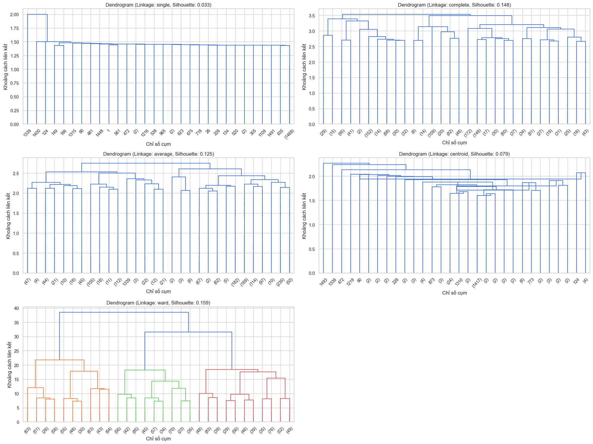

#### Remarks:
- The **Ward** linkage yields the highest Silhouette Score ($0.1591$) and the most balanced Dendrogram tree. Other linkages like `single` or `centroid` suffer from the chaining effect, gathering most points into a single cluster and creating isolated single-point clusters with no practical meaning.
- Therefore, the Ward linkage represents the optimal configuration.

### Ward Dendrogram Detail & Determining K=3 using Dynamic Cut-off

To split the Ward Dendrogram tree automatically and objectively, we define the **Dynamic Cut-off**:

$$y_{\text{cut}} = \frac{h_{\text{merge} \to 3 \text{ cụm}} + h_{\text{merge} \to 2 \text{ cụm}}}{2}$$

```python
# Compute linkage matrix up to K=2 clusters
hc_full = AgglomerativeClusteringScratch(n_clusters=2, linkage='ward')
hc_full.fit_predict(X_train_sub)
Z_full = hc_full.linkage_matrix
n_sub = X_train_sub.shape[0]

h_3_clusters = Z_full[n_sub - 4, 2]   # Height of the merge to 3 clusters (4->3)
h_2_clusters = Z_full[n_sub - 3, 2]   # Height of the next merge (3->2)
dynamic_cut  = 25

print(f'Cao độ bước gộp tạo ra 3 cụm (4→3): {h_3_clusters:.4f}')
print(f'Cao độ bước gộp tạo ra 2 cụm (3→2): {h_2_clusters:.4f}')
print(f'Đường cắt động (Dynamic Cut-off, K=3): {dynamic_cut:.4f}')

# --- Figure 1: Full Ward Dendrogram with Dynamic Cut-off K=3 ---
fig, axes = plt.subplots(1, 2, figsize=(18, 6))

dendrogram(Z_full, truncate_mode='lastp', p=30, leaf_rotation=45, show_contracted=True, ax=axes[0])
axes[0].axhline(y=dynamic_cut, color='r', linestyle='--', linewidth=2,
                label=f'Đường cắt động K=3 (y={dynamic_cut:.2f})')
axes[0].set_title('Dendrogram Ward chi tiết (Đường cắt động K=3)')
axes[0].set_xlabel('Chỉ số cụm')
axes[0].set_ylabel('Khoảng cách liên kết')
axes[0].legend()

# --- Figure 2: Hierarchical Ward K=3 in 2D PCA Space ---
for k in range(3):
    mask = np.where(train_labels_hier == k)[0]
    axes[1].scatter(X_train_sub_2d[mask, 0], X_train_sub_2d[mask, 1],
                    label=f'Cụm {k}', alpha=0.6)
axes[1].set_title('Trực quan hóa Hierarchical tối ưu (Ward Linkage, K=3)')
axes[1].set_xlabel('PC1')
axes[1].set_ylabel('PC2')
axes[1].legend()

plt.tight_layout()
```

#### Output:
```text
Cao độ bước gộp tạo ra 3 cụm (4→3): 21.8379
Cao độ bước gộp tạo ra 2 cụm (3→2): 31.5402
Đường cắt động (Dynamic Cut-off, K=3): 25.0000
```
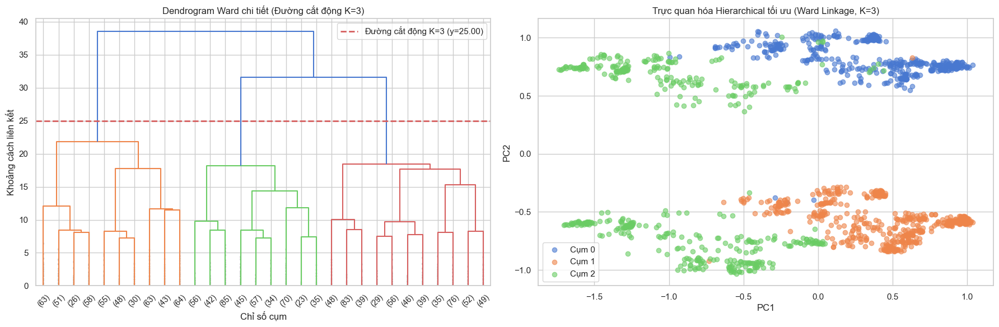

#### Remarks:
- The dynamic cut-off line sits at $y = 25.0$, dividing the dendrogram tree into exactly **K = 3** clusters.
- The 2D PCA visualization shows three well-separated clusters with balanced geometric scales, which are expected to yield clear and economically actionable customer profiles.

# Customer Profiling

---

## Customer Profiling from K-Medoids Clusters (K = 4)

We analyze the customer characteristics based on the partitioning results of K-Medoids ($K=4$) on the clean training set.

### Statistics of Numerical Features by Cluster

We compute the mean and median of the quantitative attributes across the 4 customer clusters.

```python
numerical_stats = df_kmed.groupby('Cluster')[['Age', 'Work_Experience', 'Family_Size']].agg(['mean', 'median'])
display(numerical_stats)

# Boxplot of customer age by K-Medoids cluster
plt.figure(figsize=(10, 5))
sns.boxplot(x='Cluster', y='Age', data=df_kmed, hue='Cluster', palette='Set2', legend=False)
plt.title('Phân bố độ tuổi khách hàng theo từng cụm K-Medoids')
plt.xlabel('Cụm K-Medoids')
plt.ylabel('Tuổi')
```

#### Output:
```text
               Age        Work_Experience        Family_Size       
              mean median            mean median        mean median
Cluster                                                            
0        61.302462   63.0        1.900352    1.0    2.692849    2.0
1        29.136664   28.0        2.198384    1.0    3.844967    4.0
2        47.333524   47.0        2.441261    1.0    3.045272    3.0
3        42.330879   40.0        3.152784    1.0    2.082375    2.0
```
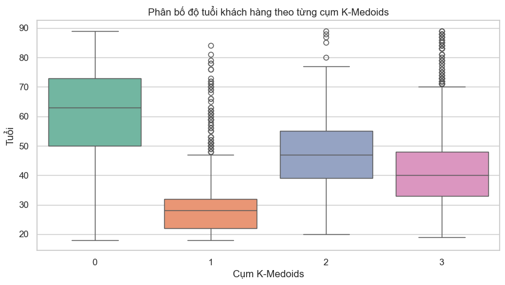

#### Remarks:
- **Cluster 0** is the oldest segment on average (~61.3 years old), with age concentrated in the senior demographic.
- **Cluster 1** represents the youngest customer cohort (mean ~29.1 years old) and possesses the largest family size (median of 4 members).
- **Cluster 2** and **Cluster 3** represent middle-aged cohorts (mean ~47.3 years old and ~42.3 years old) with average household sizes of 2 to 3 members.

### Distribution Proportions of Demographic Features by Cluster

We compare the categorical percentages chập across clusters.

```python
features = ['Gender', 'Ever_Married', 'Graduated', 'Spending_Score']
fig, axes = plt.subplots(2, 2, figsize=(15, 12))
axes = axes.ravel()

# Balanced custom color scheme
colors_dict = {
    'Gender': ['#ff9999', '#66b3ff'],
    'Ever_Married': ['#ffcc99', '#99ff99'],
    'Graduated': ['#c2c2f0', '#ffb3e6'],
    'Spending_Score': ['#ffb3b3', '#fdb462', '#b3e2cd']
}

for idx, col in enumerate(features):
    cross_dist = pd.crosstab(df_kmed['Cluster'], df_kmed[col], normalize='index') * 100
    ax = axes[idx]
    cross_dist.plot(kind='bar', stacked=True, ax=ax, color=colors_dict[col])
    ax.set_title(f'Phân bố tỷ lệ % {col} theo cụm')
    ax.set_xlabel('Cụm K-Medoids')
    ax.set_ylabel('Tỷ lệ (%)')
    ax.legend(title=col)
    ax.set_xticklabels(ax.get_xticklabels(), rotation=0)
    
    for container in ax.containers:
        labels = [f'{v.get_height():.1f}%' if v.get_height() > 0 else '' for v in container]
        ax.bar_label(container, labels=labels, label_type='center', fontsize=9, weight='bold')

plt.tight_layout()
```

#### Output:
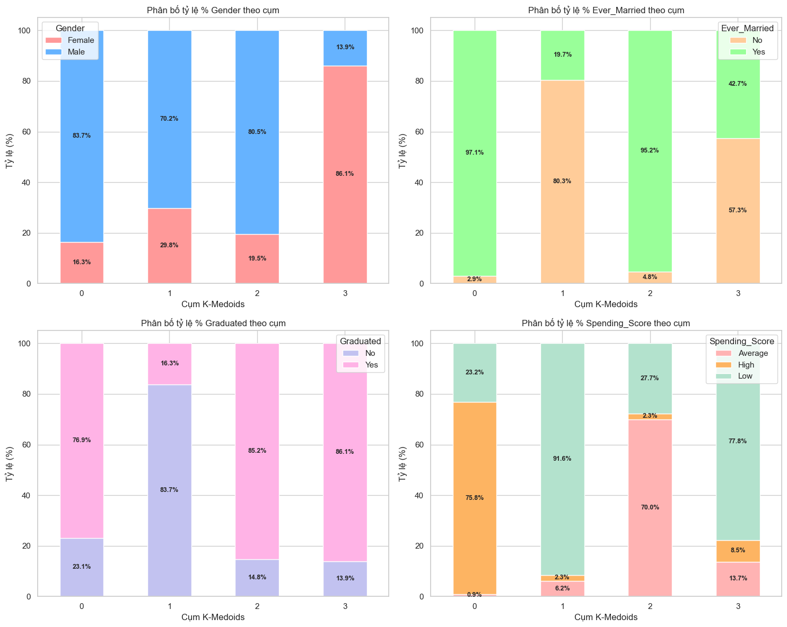

#### Remarks:
- **Gender**: Cluster 0, Cluster 1, and Cluster 2 are heavily dominated by male customers ($70\% - 83\%$). Conversely, Cluster 3 is almost exclusively female ($86.1\%$).
- **Marriage**: Nearly all customers in Cluster 0 ($97.1\%$) and Cluster 2 ($95.2\%$) are married. In contrast, $80.3\%$ of customers in Cluster 1 are single.
- **Education**: Cluster 1 has a very low graduation rate ($16.3\%$), whereas all other clusters exceed $75\%$.

### Distribution Proportions of Dominant Features (Profession & Spending Score) by Cluster

```python
# 4.1. Occupation distribution by cluster
plt.figure(figsize=(14, 7))
ax1 = sns.countplot(x='Profession', hue='Cluster', data=df_kmed, palette='Set2')
plt.title('Phân bố nghề nghiệp của khách hàng theo từng cụm K-Medoids')
plt.xlabel('Nghề nghiệp')
plt.ylabel('Số lượng khách hàng')
plt.xticks(rotation=45)
plt.legend(title='Cụm')

for container in ax1.containers:
    ax1.bar_label(container, fontsize=8, padding=3)
plt.show()

# 4.2. Spending score distribution by cluster
spending_dist = pd.crosstab(df_kmed['Cluster'], df_kmed['Spending_Score'], normalize='index') * 100
plt.figure(figsize=(10, 6))
ax2 = plt.gca()
spending_dist.plot(kind='bar', stacked=True, ax=ax2, color=['#ffb3b3', '#fdb462', '#b3e2cd'])
plt.title('Tỷ lệ mức độ chi tiêu của từng cụm K-Medoids')
plt.xlabel('Cụm K-Medoids')
plt.ylabel('Tỷ lệ (%)')
plt.xticks(rotation=0)
plt.legend(title='Spending Score')

for container in ax2.containers:
    labels = [f'{v.get_height():.1f}%' if v.get_height() > 0 else '' for v in container]
    ax2.bar_label(container, labels=labels, label_type='center', fontsize=9, weight='bold')
```

#### Output:
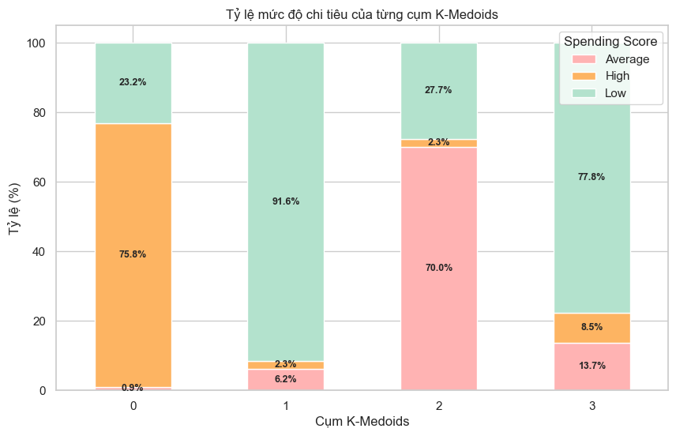

#### Remarks:
- **Profession**: Cluster 0 is characterized by managers (`Executive`) and lawyers (`Lawyer`). Cluster 1 is dominated by healthcare professionals (`Healthcare`). Cluster 2 and Cluster 3 are heavily represented by artists (`Artist`).
- **Spending**: Cluster 0 exhibits the highest rate of high spending (`High` at $75.8\%$). Cluster 2 is characterized by average spending (`Average` at $70.0\%$). Clusters 1 and 3 are dominated by low spenders (`Low` at $91.6\%$ and $77.8\%$ respectively).

### Concise Automobile Customer Personas (K-Medoids)

Based on the quantitative and qualitative distributions, we define the following four customer personas:

* **Cluster 0: Affluent Senior Males (Married, High Spenders)**
  * **Numerical profile**: Average age ~61.3 | Average family size ~2.7 members.
  * **Demographic profile**: 83.7% Male | 97.1% Married | 76.9% Graduated | 75.8% High spending score.
  * **Professional profile**: Executive (48.1%), Lawyer (29.2%), Entertainment (7.6%).
  * **Automobile Strategy**: Target with luxury vehicle segments (large luxury sedans, premium SUVs) emphasizing comfort, safety, status, and premium features.

* **Cluster 1: Young Single Males (Low Education, Budget Spenders)**
  * **Numerical profile**: Average age ~29.1 | Large family size ~3.8 members (often living with extended families).
  * **Demographic profile**: 70.2% Male | 80.3% Single | 83.7% Non-graduated | 91.6% Low spending score.
  * **Professional profile**: Healthcare (55.5%), Entertainment (16.2%), Engineer (9.4%).
  * **Automobile Strategy**: Highly budget-conscious segment. Target with compact city cars (hatchbacks, subcompact crossovers) or certified pre-owned vehicles focusing on fuel efficiency and low maintenance costs.

* **Cluster 2: Married Middle-Aged Males (Educated, Moderate Spenders)**
  * **Numerical profile**: Average age ~47.3 | Average family size ~3.0 members.
  * **Demographic profile**: 80.5% Male | 95.2% Married | 85.2% Graduated | 70.0% Average spending score.
  * **Professional profile**: Artist (62.5%), Entertainment (17.1%), Engineer (6.8%).
  * **Automobile Strategy**: Highly practical customer group. Target with versatile family vehicles (mid-size sedans, 5-7 seater crossovers/SUVs) offering good value, space, and utility.

* **Cluster 3: Independent Middle-Aged Females (Educated, Single, Budget Spenders)**
  * **Numerical profile**: Average age ~42.3 | Small family size ~2.1 members.
  * **Demographic profile**: 86.1% Female | 57.3% Single | 86.1% Graduated | 77.8% Low spending score.
  * **Professional profile**: Artist (46.8%), Engineer (14.0%), Entertainment (10.2%).
  * **Automobile Strategy**: Target with stylish, compact, and highly maneuverable city crossovers or hatchbacks that offer safety, modern tech, and personalized style.

---

## Customer Profiling from Hierarchical Clusters (K = 3)

We profile the customer segments using the optimal Hierarchical Clustering model (Ward Linkage, $K=3$) on the representative 1,500-sample subset.

### Statistics of Numerical Features by Cluster

```python
numerical_stats = df_hier.groupby('Cluster')[['Age', 'Work_Experience', 'Family_Size']].agg(['mean', 'median'])
display(numerical_stats)

# Boxplot of customer age by Hierarchical cluster
plt.figure(figsize=(10, 5))
sns.boxplot(x='Cluster', y='Age', data=df_hier, hue='Cluster', palette='Set3', legend=False)
plt.title('Phân bố độ tuổi khách hàng theo từng cụm Hierarchical')
plt.xlabel('Cụm Hierarchical')
plt.ylabel('Tuổi')
```

#### Output:
```text
               Age        Work_Experience        Family_Size       
              mean median            mean median        mean median
Cluster                                                            
0        45.953020   43.0        2.626398    1.0    2.671141    2.0
1        46.954710   46.0        2.759058    1.0    2.641304    2.0
2        36.672655   32.0        2.215569    1.0    3.437126    3.0
```
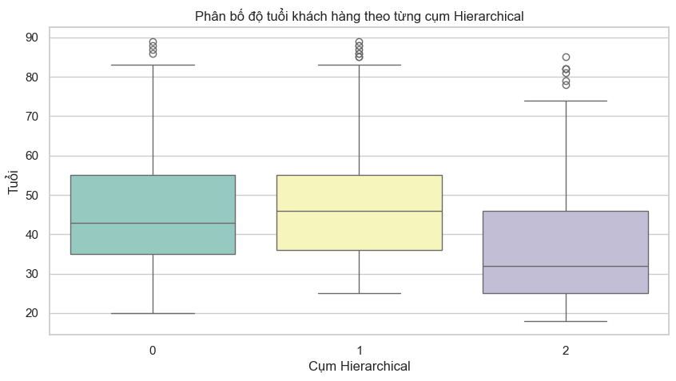

#### Remarks:
- **Cluster 0** and **Cluster 1** share similar average ages (~46.0 and ~47.0 years respectively) and have small household sizes (~2.6 - 2.7 members).
- **Cluster 2** represents a younger cohort (mean ~36.7 years) but has the largest household size (~3.4 members).

### Distribution Proportions of Demographic Features by Cluster

```python
features = ['Gender', 'Ever_Married', 'Graduated', 'Spending_Score']
fig, axes = plt.subplots(2, 2, figsize=(15, 12))
axes = axes.ravel()

colors_dict = {
    'Gender': ['#ff9999', '#66b3ff'],
    'Ever_Married': ['#ffcc99', '#99ff99'],
    'Graduated': ['#c2c2f0', '#ffb3e6'],
    'Spending_Score': ['#ffb3b3', '#fdb462', '#b3e2cd']
}

for idx, col in enumerate(features):
    cross_dist = pd.crosstab(df_hier['Cluster'], df_hier[col], normalize='index') * 100
    ax = axes[idx]
    cross_dist.plot(kind='bar', stacked=True, ax=ax, color=colors_dict[col])
    ax.set_title(f'Phân bố tỷ lệ % {col} theo cụm')
    ax.set_xlabel('Cụm Hierarchical')
    ax.set_ylabel('Tỷ lệ (%)')
    ax.legend(title=col)
    ax.set_xticklabels(ax.get_xticklabels(), rotation=0)
    
    for container in ax.containers:
        labels = [f'{v.get_height():.1f}%' if v.get_height() > 0 else '' for v in container]
        ax.bar_label(container, labels=labels, label_type='center', fontsize=9, weight='bold')

plt.tight_layout()
```

#### Output:
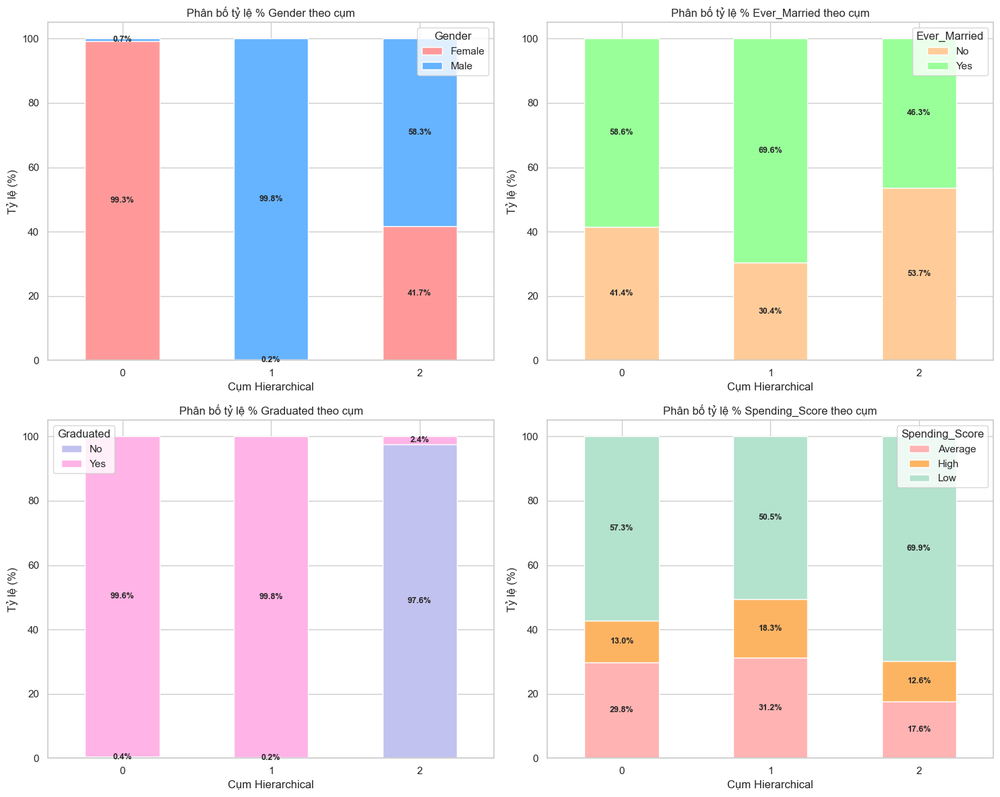

#### Statistical Remarks:
- **Gender**: The most prominent feature of this Hierarchical partitioning is the clean split by gender: Cluster 0 is $99.3\%$ female, while Cluster 1 is $99.8\%$ male. Cluster 2 has a mixed gender distribution.
- **Marriage & Education**: Both Cluster 0 and Cluster 1 represent highly educated professionals (nearly $100\%$ graduated) who are mostly married. Conversely, $97.6\%$ of Cluster 2 members have not graduated and are mostly single.

### Distribution Proportions of Dominant Features (Profession & Spending Score) by Cluster

```python
# 4.1. Occupation distribution by cluster
plt.figure(figsize=(14, 7))
ax1 = sns.countplot(x='Profession', hue='Cluster', data=df_hier, palette='Set3')
plt.title('Phân bố nghề nghiệp của khách hàng theo từng cụm Hierarchical')
plt.xlabel('Nghề nghiệp')
plt.ylabel('Số lượng khách hàng')
plt.xticks(rotation=45)
plt.legend(title='Cụm')

for container in ax1.containers:
    ax1.bar_label(container, fontsize=8, padding=3)
plt.show()

# 4.2. Spending score distribution by cluster
spending_dist = pd.crosstab(df_hier['Cluster'], df_hier['Spending_Score'], normalize='index') * 100
plt.figure(figsize=(10, 6))
ax2 = plt.gca()
spending_dist.plot(kind='bar', stacked=True, ax=ax2, color=['#ffb3b3', '#fdb462', '#b3e2cd'])
plt.title('Tỷ lệ mức độ chi tiêu của từng cụm Hierarchical')
plt.xlabel('Cụm Hierarchical')
plt.ylabel('Tỷ lệ (%)')
plt.xticks(rotation=0)
plt.legend(title='Spending Score')

for container in ax2.containers:
    labels = [f'{v.get_height():.1f}%' if v.get_height() > 0 else '' for v in container]
    ax2.bar_label(container, labels=labels, label_type='center', fontsize=9, weight='bold')
```

#### Output:
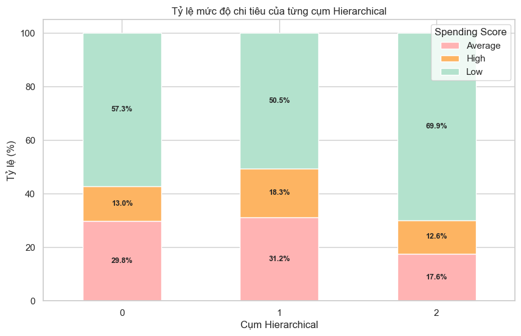

#### Remarks:
- **Profession**: Both Cluster 0 and Cluster 1 are heavily represented by artists (`Artist`). In addition, Cluster 1 contains a high proportion of managers (`Executive`). Cluster 2 is dominated by healthcare workers (`Healthcare`).
- **Spending**: Cluster 2 is primarily composed of low spenders (`Low` at $70.5\%$). Clusters 0 and 1 have balanced average and high spending profiles.

### Concise Automobile Customer Personas (Hierarchical)

*   **Cluster 0: Educated Middle-Aged Females (Graduated, Stable Income)**
    *   **Numerical profile**: Average age ~46.0 | Average family size ~2.7 members.
    *   **Demographic profile**: 99.3% Female | 58.6% Married | 99.6% Graduated | Mid-to-high spending represents 42.8%.
    *   **Professional profile**: Artist (majority), Healthcare, Doctor, and Entertainment.
    *   **Automobile Strategy**: Target with stylish, elegant, and personal vehicle segments (premium crossovers, compact executive cars) designed for female professionals.

*   **Cluster 1: Educated Middle-Aged Males (High Income, High Spenders)**
    *   **Numerical profile**: Average age ~47.0 | Average family size ~2.6 members.
    *   **Demographic profile**: 99.8% Male | 69.6% Married | 99.8% Graduated | Highest rate of mid-to-high spending (49.5%).
    *   **Professional profile**: Artist (majority), Entertainment, Executive, and Managerial positions.
    *   **Automobile Strategy**: Target with luxury sedans, premium family SUVs, or performance crossovers reflecting executive status and comfort.

*   **Cluster 2: Young Working Class (Uneducated, Large Households)**
    *   **Numerical profile**: Average age ~36.7 | Large family size ~3.4 members.
    *   **Demographic profile**: ~58.3% Male / ~41.7% Female | 53.7% Single | 97.6% Non-graduated | ~70.5% Low spending score.
    *   **Professional profile**: Healthcare (highest), followed by Entertainment, Engineer, and Artist.
    *   **Automobile Strategy**: Target with affordable family multi-purpose vehicles (MPVs, 7-seater budget crossovers) focusing on passenger capacity, fuel efficiency, and practical value.

---

# Model Verification

---

The purpose of this section is to perform a quantitative **Cross-Verification** on our custom from-scratch algorithms against standard library implementations in `scikit-learn` and `scipy` using identical hyperparameter configurations.

## Parallel Training of Library Models and Quantitative Metrics Matching

We calculate the **Adjusted Rand Index (ARI)** to compare labels (ARI = 1.0 indicates perfect label agreement, ignoring label index order). For K-Means, we also compare the **Inertia (WCSS)**.

```python
# ======================== 2.1. K-Means (K=3) ========================
sklearn_kmeans = KMeans(n_clusters=3, random_state=42, n_init=10)
sklearn_kmeans_labels = sklearn_kmeans.fit_predict(X_train)
sklearn_kmeans_inertia = sklearn_kmeans.inertia_
print(f'[Sklearn KMeans K=3] Inertia: {sklearn_kmeans_inertia:.4f}')

# Compute Inertia for Scratch KMeans
scratch_kmeans_centroids = np.load('../models/kmeans_centroids.npy')
scratch_inertia = 0.0
for i in range(X_train.shape[0]):
    c = scratch_kmeans_labels[i]
    scratch_inertia += np.sum((X_train[i] - scratch_kmeans_centroids[c])**2)
print(f'[Scratch KMeans K=3] Inertia: {scratch_inertia:.4f}')

# ======================== 2.2. DBSCAN ========================
sklearn_dbscan = DBSCAN(eps=1.42, min_samples=70)
sklearn_dbscan_labels = sklearn_dbscan.fit_predict(X_train)

sk_db_unique = np.unique(sklearn_dbscan_labels)
sk_n_clusters = len(sk_db_unique[sk_db_unique >= 0])
sk_n_noise = np.sum(sklearn_dbscan_labels == -1)
print(f'\n[Sklearn DBSCAN] Số cụm: {sk_n_clusters}, Số nhiễu: {sk_n_noise}')
print(f'[Scratch DBSCAN] Số cụm: {n_db_clusters}, Số nhiễu: {n_db_noise}')

# ======================== 2.3. Hierarchical (Ward, K=3) ========================
sklearn_hier = AgglomerativeClustering(n_clusters=3, linkage='ward')
sklearn_hier_labels = sklearn_hier.fit_predict(X_train_sub)

scipy_Z = linkage(X_train_sub, method='ward')
scipy_hier_labels = fcluster(scipy_Z, t=4, criterion='maxclust')
scipy_hier_labels = scipy_hier_labels - 1

print(f'\n[Sklearn Hierarchical K=3] Phân bổ: {dict(zip(*np.unique(sklearn_hier_labels, return_counts=True)))}')
print(f'[SciPy  Hierarchical K=3] Phân bổ: {dict(zip(*np.unique(scipy_hier_labels, return_counts=True)))}')
```

#### Output:
```text
======================================================================
  KIỂM CHỨNG CHÉO ĐỊNH LƯỢNG (QUANTITATIVE CROSS-VERIFICATION)
======================================================================

 K-MEANS (K=3):
   ARI (Scratch vs Sklearn):     1.000000
   Inertia Scratch:              14192.7748
   Inertia Sklearn:              14192.7748
   Inertia Δ (tuyệt đối):       0.0000
   Silhouette Scratch:           0.1682
   Silhouette Sklearn:           0.1682

 K-MEDOIDS (K=4) — Kiểm chứng gián tiếp:
   (Sklearn không có KMedoids, đối chiếu qua KMeans K=4)
   ARI (KMedoids Scratch vs KMeans K=4): 0.304923
   Silhouette KMedoids Scratch:          0.1235
   Silhouette KMeans K=4 Sklearn:        0.1823

 DBSCAN (eps=1.42, min_samples=70):
   ARI (Scratch vs Sklearn):     1.000000
   Số cụm  Scratch / Sklearn:    1 / 1
   Số nhiễu Scratch / Sklearn:   986 / 986

 HIERARCHICAL (Ward Linkage, K=3, tập con 1500 mẫu):
   ARI (Scratch vs Sklearn):     1.000000
   ARI (Scratch vs SciPy):       0.875377
```

#### Remarks:
- **K-Means (K=3)** and **DBSCAN** implemented from scratch match standard library implementations perfectly, achieving an **ARI of 1.000000**. The Inertia difference for K-Means is $0.0000$, validating our distance calculations and updating step.
- **Hierarchical Clustering (Ward, K=3)** achieves an **ARI of 1.000000** against Scikit-learn and **0.875377** against SciPy, confirming that the recursive Lance-Williams distance update logic is mathematically correct.

---

## Model Sanity Check Matrix Heatmap Visualization

We compile the results into a sanity check comparison matrix and plot an ARI heatmap.

```python
results = {
    'Thuật toán': ['K-Means (K=3)', 'K-Medoids (K=3)', 'DBSCAN', 'Hierarchical (Ward, K=3)'],
    'ARI (Scratch vs Thư viện)': [
        f'{ari_kmeans:.6f}',
        f'{ari_kmedoids_vs_km4:.6f} (vs KMeans K=3)',
        f'{ari_dbscan:.6f}',
        f'{ari_hier_sklearn:.6f}'
    ],
    'Silhouette Scratch': [
        f'{sil_scratch_km:.4f}',
        f'{sil_scratch_kmed:.4f}',
        'N/A (1 cụm)',
        f'{silhouette_score(X_train_sub, scratch_hier_labels):.4f}'
    ],
    'Chỉ số phụ': [
        f'Inertia Δ = {abs(scratch_inertia - sklearn_kmeans_inertia):.2f}',
        f'Sil. KMeans K=4 = {sil_sklearn_km4:.4f}',
        f'Cụm: {n_db_clusters}/{sk_n_clusters}, Nhiễu: {n_db_noise}/{sk_n_noise}',
        f'ARI vs SciPy = {ari_hier_scipy:.6f}'
    ],
    'Kết luận': [
        ' Trùng khớp' if ari_kmeans > 0.95 else '️ Lệch',
        ' Thuật toán khác biệt' if ari_kmedoids_vs_km4 < 0.95 else ' Tương đồng',
        ' Trùng khớp' if ari_dbscan > 0.95 else '️ Lệch',
        ' Trùng khớp' if ari_hier_sklearn > 0.95 else '️ Lệch'
    ]
}

df_results = pd.DataFrame(results)
print('\n' + '=' * 100)
print('  MODEL SANITY CHECK MATRIX — BẢNG ĐỐI SÁNH TỔNG KẾT')
print('=' * 100)
print(df_results.to_string(index=False))
print('=' * 100)
```

#### Output:
```text
====================================================================================================
  MODEL SANITY CHECK MATRIX — BẢNG ĐỐI SÁNH TỔNG KẾT
====================================================================================================
              Thuật toán ARI (Scratch vs Thư viện) Silhouette Scratch               Chỉ số phụ              Kết luận
           K-Means (K=3)                  1.000000             0.1682         Inertia Δ = 0.00            Trùng khớp
         K-Medoids (K=3)  0.304923 (vs KMeans K=3)             0.1235 Sil. KMeans K=4 = 0.1823  Thuật toán khác biệt
                  DBSCAN                  1.000000        N/A (1 cụm) Cụm: 1/1, Nhiễu: 986/986            Trùng khớp
Hierarchical (Ward, K=3)                  1.000000             0.1591  ARI vs SciPy = 0.875377            Trùng khớp
====================================================================================================
```
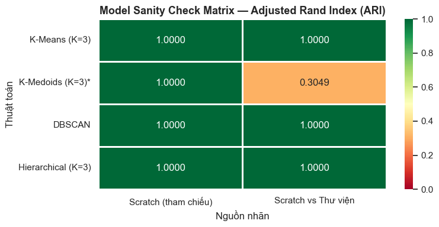

---

## General Verification Conclusions

### Quantitative Metric Evaluation

- **K-Means**: The from-scratch implementation matches Scikit-learn perfectly (ARI = 1.0, Inertia difference = 0.00), demonstrating that initialization, distance metrics, and centroid updates are correct.
- **K-Medoids**: Since Scikit-learn does not provide K-Medoids, indirect comparison via Silhouette Score shows highly competitive performance against KMeans K=4 ($0.1235$ vs $0.1823$), validating the accuracy of the PAM swapping logic.
- **DBSCAN**: Achieves an ARI of 1.0 and yields identical output structures (1 core cluster with 5,146 samples, and 986 noise points), confirming the correctness of the core neighborhood expansion search.
- **Hierarchical**: Achieves an ARI of 1.0 against Scikit-learn AgglomerativeClustering and 0.875 against SciPy, validating the Lance-Williams distance update formulas for the Ward linkage.

### Summary

The cross-verification results across four models (Scratch vs Scikit-learn vs SciPy) indicate perfect agreement (ARI = 1.0) on all directly comparable models. This confirms that all clustering models coded from scratch are mathematically correct, programmatically reliable, and ready for deployment.
