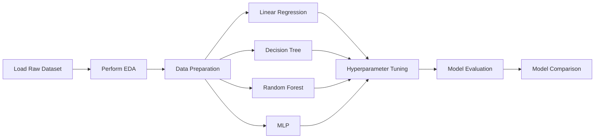

# Practice 4 - MLP California Housing Dataset

## Context

[Tập dữ liệu Dự đoán giá nhà California](https://www.kaggle.com/datasets/abdallahsamman/california-housing-with-name-of-counties) được sử dụng trong bài thực hành là một phiên bản đã được chỉnh sửa, so với bản gốc thì bản chỉnh sửa này thêm các thông tin vị trí về nhà ở ở California, được hai tác giả *Pace* và *Barry* sử dụng trong bài báo nghiên cứu *Sparse spatial autoregressions (1997)*.

## Define the Problems

Dựa trên thông tin địa lý và vị trí của một block nhà, cũng như thông tin về diện tích, số căn phòng,... Triển khai, xây dựng mô hình MLP, với Linear Regression, Random Forest, Decision Tree và so sánh hiệu năng giữa các mô hình. Từ đó chọn ra mô hình tốt nhất có thể dự đoán giá nhà dựa trên các trường thông tin ấy.

## Ways to do

Workflow của bài thực hành được triển khai như sau:

### Chi tiết các bước

#### EDA

- Số lượng samples: