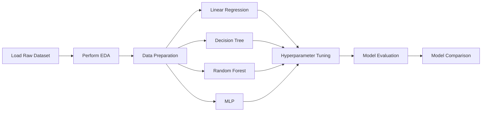

# Practice 4 - California Housing Price Prediction

## Context

Bài thực hành sử dụng bộ dữ liệu [California Housing with name of counties](https://www.kaggle.com/datasets/abdallahsamman/california-housing-with-name-of-counties), được mở rộng từ California Housing dataset. So với bộ dữ liệu gốc, phiên bản trong bài lab có thêm các thông tin vị trí như thành phố, khoảng cách đến bờ biển và khoảng cách đến các thành phố lớn tại California.

Mục tiêu của bài lab là xây dựng một quy trình học máy hoàn chỉnh cho bài toán hồi quy, từ khám phá dữ liệu đến huấn luyện, tinh chỉnh và so sánh nhiều mô hình khác nhau.

## Problem Definition

Bài toán cần giải quyết là dự đoán `Median_House_Value` dựa trên các đặc trưng về thu nhập, tuổi nhà, số phòng, dân số, số hộ gia đình, tọa độ địa lý, khoảng cách đến các khu vực quan trọng và thông tin phân loại như `ocean_proximity`, `City`.

Các mô hình dự kiến triển khai gồm:

- Linear Regression
- Decision Tree Regressor
- Random Forest Regressor
- Multi-layer Perceptron (MLP)

Kết quả của các mô hình sẽ được đánh giá và so sánh để chọn ra mô hình phù hợp nhất cho bài toán dự đoán giá nhà.

## Dataset

Dữ liệu thô được lưu tại:

```text
practice_4/data/raw/California_Housing_CitiesAdded.csv
```

Một số nhóm thuộc tính chính trong dữ liệu:

- Target: `Median_House_Value`
- Kinh tế - xã hội: `Median_Income`, `Population`, `Households`
- Thông tin nhà ở: `Median_Age`, `Tot_Rooms`, `Tot_Bedrooms`
- Vị trí địa lý: `Latitude`, `Longitude`, `Distance_to_coast`, `Distance_to_LA`, `Distance_to_SanDiego`, `Distance_to_SanJose`, `Distance_to_SanFrancisco`
- Biến phân loại: `ocean_proximity`, `City`

## Workflow

Workflow tổng quát của bài thực hành:



## Exploratory Data Analysis

Dataset có **20,640 records** và **16 columns**, trong đó `Median_House_Value` là biến mục tiêu cần dự đoán. Dữ liệu gồm **14 numerical features** và **2 categorical features** là `ocean_proximity`, `City`.

Kết quả kiểm tra missing values cho thấy dataset **không có giá trị thiếu**, vì vậy ở bước preprocessing không cần imputation cho dữ liệu hiện tại.

Phân phối của `Median_House_Value` có giá trị trung bình khoảng **206,856$**, median khoảng **179,700$**, và giá trị lớn nhất là **500,001$**. Phân phối này thể hiện chính xác với thực tế khi khảo sát tập dữ liệu này tại California, vốn là một trong những bang có giá nhà cao nhất Hoa Kỳ.

Với numerical features, EDA cho thấy một số biến có outliers theo IQR, đặc biệt là:

- `Distance_to_coast`: khoảng **11.51%** records được xem là outliers.
- `Tot_Rooms`: khoảng **6.24%** records.
- `Tot_Bedrooms`: khoảng **6.21%** records.
- `Households`: khoảng **5.91%** records.
- `Population`: khoảng **5.79%** records.
- `Median_House_Value`: khoảng **5.19%** records.

Phân tích correlation với target cho thấy:

- `Median_Income` có tương quan dương mạnh nhất với `Median_House_Value`, khoảng **0.688**.
- `Distance_to_coast` có tương quan âm đáng chú ý với target, khoảng **-0.469**.
- Các biến vị trí và khoảng cách như `Latitude`, `Distance_to_LA`, `Distance_to_SanDiego`, `Longitude` có tương quan âm nhẹ đến trung bình.
- Các biến về số lượng phòng, dân số và hộ gia đình có tương quan tuyến tính yếu hơn với target.

Với categorical features, `ocean_proximity` cho thấy sự khác biệt rõ về giá nhà. Nhóm `INLAND` có median target thấp nhất, khoảng **108,500**, trong khi các nhóm gần biển hoặc gần vịnh như `NEAR BAY`, `NEAR OCEAN`, `<1H OCEAN` có median cao hơn. Nhóm `ISLAND` có giá trị cao nhưng chỉ có **5 records**.

Biến `City` có nhiều nhóm, trong đó các nhóm xuất hiện nhiều nhất gồm `Los Angeles`, `Orange`, `San Diego`, `Alameda`, `Santa Clara`. Ngoài ra, `Los Angeles` cũng chính là thành phố duy nhất mà xuất hiện 5 khu nhà (blocks) ở trên `ISLAND`

Biểu đồ scatter theo `Longitude` và `Latitude` cho thấy giá nhà có pattern không gian rõ rệt. Các khu vực ven biển và gần những thành phố lớn thường có giá nhà cao hơn, trong khi nhiều khu vực sâu trong đất liền có giá thấp hơn.

## Data Preparation

Sau khi EDA, dữ liệu sẽ được tiền xử lý để phù hợp với các mô hình học máy. Các bước dự kiến gồm:

- Tách biến mục tiêu `Median_House_Value` khỏi tập đặc trưng.
- Xử lý giá trị thiếu nếu có.
- Mã hóa các biến phân loại như `ocean_proximity` và `City`.
- Chuẩn hóa hoặc scale các đặc trưng số, đặc biệt cần thiết cho mô hình MLP.
- Chia dữ liệu thành tập train và test.
- Có thể tạo thêm một số đặc trưng mới, ví dụ số phòng trung bình trên mỗi hộ gia đình hoặc số phòng ngủ trung bình trên tổng số phòng.


## Modeling

Bài lab sẽ triển khai nhiều mô hình hồi quy để so sánh hiệu năng:

- Linear Regression được dùng làm baseline đơn giản.
- Decision Tree giúp kiểm tra khả năng học các quan hệ phi tuyến.
- Random Forest cải thiện độ ổn định bằng cách kết hợp nhiều cây quyết định.
- MLP được dùng để thử nghiệm mô hình mạng nơ-ron cho bài toán hồi quy.

Mỗi mô hình sẽ được huấn luyện trên cùng một tập dữ liệu đã tiền xử lý để đảm bảo việc so sánh công bằng.

## Hyperparameter Tuning

Sau khi có kết quả baseline, bài lab sẽ tinh chỉnh hyperparameters với các model tương ứng:

- Decision Tree: `max_depth`, `min_samples_split`, `min_samples_leaf`
- Random Forest: `n_estimators`, `max_depth`, `min_samples_split`, `max_features`
- MLP: số hidden layers, số neurons, learning rate, activation function, số vòng lặp huấn luyện

Việc tuning có thể thực hiện bằng `GridSearchCV`, `RandomizedSearchCV` hoặc một quy trình thử nghiệm có kiểm soát.

## Evaluation

Các mô hình sẽ được đánh giá bằng các metric hồi quy:

- $R^2$: đo mức độ mô hình giải thích được phương sai của dữ liệu.
- $RMSE$: đo sai số dự đoán theo cùng đơn vị với giá nhà, nhấn mạnh các lỗi lớn.
- $MAPE$: đo sai số phần trăm trung bình, giúp diễn giải mức lệch tương đối.

Kết quả đánh giá sẽ được tổng hợp thành bảng để so sánh trực tiếp giữa các mô hình.

## Expected Outcome

Sau khi hoàn thành bài lab, kết quả mong đợi gồm:

- Một pipeline xử lý dữ liệu rõ ràng cho bài toán California Housing.
- Các phân tích EDA giúp hiểu đặc điểm dữ liệu.
- Các mô hình hồi quy đã được huấn luyện và tinh chỉnh.
- Bảng so sánh hiệu năng giữa Linear Regression, Decision Tree, Random Forest và MLP.
- Kết luận về mô hình phù hợp nhất dựa trên các metric đánh giá.
